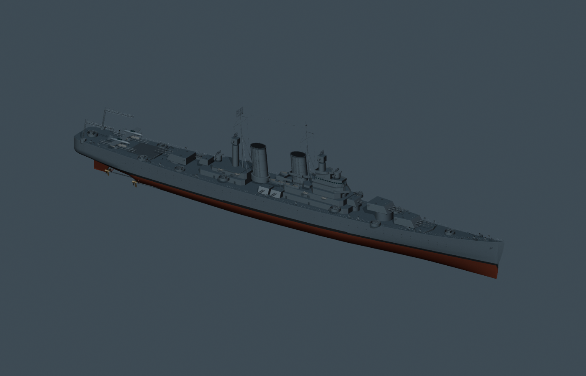

# Baltimore: references and reconstruction method

This is an independently authored model targeting USS Baltimore CA-68 in October 1943, normalized to the Navy's documented limiting keel draft. Historical accuracy remains under review. The earlier “about 80%” estimate described work remaining; there is no measured whole-ship historical-accuracy percentage.

## Reference material actually used

| Source | Open the material | What it contributes and its limits |
| --- | --- | --- |
| US Navy, *Ships' Data, U.S. Naval Vessels*, NAVSHIPS 250-010, 15 April 1945, pp. 26–31 | [Public PDF](https://shipscribe.com/pubs/SDB1945v1.pdf) · [retained relevant pages](../references/ships-data-1945-extract.pdf) · [dimension table image](../references/ships-data-1945-pages-26-27.png) | Baltimore-specific overall dimensions, draft categories, displacement and principal equipment. A 1945 table does not establish the ship's exact October 1943 loading. |
| Baltimore Booklet of General Plans, sheet 5 of 6; original 1942 drawing, finished-plan stamp 30 June 1943 | [Archive record](https://archive.org/details/ca68bogp1943) · [retained 20,003 × 10,081 scan](../references/navy-bgp-1943-06-30.jpg) · [navigating-bridge detail](../references/bridge-navigation-trace.jpg) | Frame-indexed bridge plans, director positions, funnel walkways and a printed open-bridge height. Only this one sheet is available. Later equipment annotations require separation from original geometry. |
| Bureau of Ships Design 16D drawing, 30 December 1943, 80-G-109723 | [Navy catalog description](https://www.ibiblio.org/hyperwar/OnlineLibrary/photos/images/g100000/g109723c.htm) · [drawing](../references/navy-starboard-plan-1943.jpg) | Side, deck and transverse projections used to measure the silhouette and longitudinal landmarks. It is a camouflage drawing, not a dimensioned hull-lines plan. Its later dazzle scheme is not applied to this model. |
| US Navy OP 1112, p. 517, CA-68/CA-122 three-gun 8-inch turret section, 15 January 1945 | [Public scan](https://www.navweaps.com/Weapons/WNUS_8-55_mk12-15_ca68_turret_sketch_pic.jpg) · [retained drawing](../references/op1112-baltimore-turret.jpg) | Dimension chains for turret fore/aft extent, trunnion placement, roller path, recoil and elevation. This section does not establish the complete gunhouse plan or width. |
| Dated Navy photographs: 15 April and 10 September 1943 | [Commissioning photograph](https://www.ibiblio.org/hyperwar/OnlineLibrary/photos/images/h91000/h91457.jpg) · [large retained scan](../references/navy-commissioning-1943-highres.jpg) · [September photograph](https://www.ibiblio.org/hyperwar/OnlineLibrary/photos/images/h91000/h91452.jpg) | Visual cross-checks of bridge/director order, masts, funnels, cranes and configuration. Perspective photographs are not treated as orthographic measurements. The commissioning photograph lacks the subsequently installed radar equipment. |
| USS Quincy CA-71 docking plan, revision B, 1 July 1946 | [Archive record](https://archive.org/details/ca71gad1946) · [section detail](../references/quincy-sections-inspection.jpg) · [shaft detail](../references/quincy-shafts-inspection.jpg) · [rudder detail](../references/quincy-rudder-inspection.jpg) | Sister-ship evidence for transverse shape, keel, staggered shafts and balanced rudder. Quincy's length, stern extension and loading are not substituted for Baltimore's. Docking-block offsets are not full hull offsets. |
| USS Canberra CA-70 cross sections, sheet dated 25 February 1953 | [Archive record](https://archive.org/details/ca70bogp1953) · [retained scan](../references/navy-canberra-sections-1953.jpg) | Original class hull/deck outlines at selected frames. The drawing also contains missile-conversion changes; applying its original hull geometry to Baltimore is an explicit inference. |

Additional supporting sources and retained-file checksums are in the [complete source register](../references/sources.json). A later October 1944 Baltimore photograph helps inspect turret details, but its altered fittings are not automatically backdated. The related Mk 29 twin 5-inch drawing is a known variant mismatch for Baltimore's Mk 32 and cannot certify that mount. No GameModels3D geometry or textures have been used.

## How the model was fitted

1. **Establish dimensions and a waterline datum.** Feet and inches are converted to meters. The blueprint uses 205.2574 m overall length, 202.3872 m waterline length, 21.59 m extreme beam and 7.366 m limiting keel draft. The separately tabulated 8.1788 m navigational draft includes projections and is not used as the hull's keel depth. See [measurement inputs](../references/measurements.json).

2. **Calibrate drawings before tracing.** On the retained starboard drawing, stern and bow landmarks span 1,285 pixels. Matching that span to documented length gives approximately 6.2604 pixels per meter. Turret-axis stations were measured against that scale, with an estimated ±0.65 m scan/interpretation uncertainty. Bridge traces use the numbered frame grid and a 4 ft / 1.2192 m frame pitch. The trace conversion accounts for the observed centerline slope. Absolute frame-zero placement still includes a class-derived assumption.

3. **Retain the measured points and assumptions.** [Bridge study](../references/bridge-study.json) stores source-image coordinates, scale, datum and inferred levels. Forward bridge outlines were traced from the sheet; one observed side was reflected across the centerline. The corrected model places the navigating bridge above the flag bridge and uses circular director supports. Unresolved asymmetry and later wall changes remain recorded.

4. **Construct the hull from sections.** The blueprint retains 120 authored cross sections. The class drawings inform the rounded bilge, relatively flat floor, forefoot and afterbody; intermediate shapes are interpolated and adjusted manually. These are not 120 recovered Baltimore as-built sections. The [class hull study](../references/class-hull-study.json) retains the observed trace, interpolation templates, shaft/rudder inputs and assumptions.

5. **Author dimensioned components and preserve moving parts.** The turret section informs the original gun component—for example, 6 ft 2 in / 1.8796 m from turret axis to trunnion and 32 in / 0.8128 m recoil. Blender authoring uses the versioned blueprint and shared component catalog. Training, elevation, recoil and muzzle nodes stay separate. Local Blender was used; Blender MCP was unavailable. Photographs and scans are reference material, not model textures.

6. **Compare and measure the generated asset.** Profile, plan, bow, stern and quarter views provide consistent visual comparisons. A separate script decodes actual GLB vertex/index buffers, applies scene transforms and intersects hull triangles with the Y=0 plane to measure waterline length. It does not simply repeat the blueprint dimensions or trust exported bounding-box metadata. This found and corrected an earlier 0.358629 m waterline-length shortfall.

## What has been verified

For export `2b27bcad904c8a7ace47ba65c7571c97bb2f16f960c1233c7934fd048be8b035`:

| Measurement | Documented target | Measured exported geometry |
| --- | ---: | ---: |
| Overall length | 205.2574 m | 205.2574005 m |
| Extreme beam | 21.5900 m | 21.5900011 m |
| Waterline length | 202.3872 m | 202.3871994 m |
| Keel draft | 7.3660 m | 7.3660002 m |

The 5 mm acceptance tolerance checks numerical consistency of the generated geometry. It does not mean the historical reconstruction is accurate to 5 mm. See [independent measurements](dimensions.json) and [measurement implementation](../measure.ts).

The current export passed the shared ship build, 31 simulation/renderer tests and the production build; all five fixed review views were inspected. Tests include the exported hierarchy's 21 muzzle positions through training, elevation and recoil, main salvos and secondary broadside behavior.

Live visual articulation and main/secondary firing were also observed on the preceding `6e13dafe1805…` export. Its recorded salvos reduced target structure, while flooding remained zero. Those screenshots and diagnostics predate the latest bridge change; they do not close the current export's in-game review. Flooding/reset review remains unfinished.

## Current comparison images

[Dated Navy commissioning photograph](../references/navy-quarter-1943-04-15.jpg)

[Navy side/plan drawing](../references/navy-starboard-plan-1943.jpg)

[Current model profile](../generated/review/profile.png) · [plan](../generated/review/plan.png) · [bow](../generated/review/bow.png) · [stern](../generated/review/stern.png) · [quarter](../generated/review/quarter.png)

## Remaining accuracy limits

The model has not undergone photogrammetry, automated whole-ship image fitting, a quantitative silhouette-error assessment or external historical review. Whole-ship geometric error is unknown.

The largest evidence gaps are Baltimore-specific hull offsets, five missing general-plan sheets, exact 1943 AA locations/platforms, Mk 32 secondary-mount dimensions, main-turret width/roof plan, crane/catapult details and several bridge/director heights. Internal spaces, armor interactions, hydrostatics and ballistics remain gameplay approximations. Matching overall dimensions does not resolve those gaps.

The [discrepancy register](discrepancies.md) tracks these items without treating an export/test pass as historical approval.
