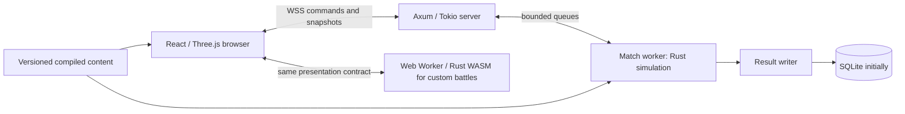

# Rust multiplayer plan — 1v1 fleet battles

Status: proposal for Claude Fable review; implementation has not started.
Date: 2026-09-07. Repository baseline: `4acb25de788d367ba3c5ac87150cbb321b60ed54`.

## Product contract

The user chose Rust to support many simulated bots and concurrent battles. The first multiplayer mode is two human players, each commanding a fleet. This supersedes the earlier exploratory co-op scope; co-op is a future extension.

Confirmed requirements:

- Select a fleet before joining a match: no more than **200,000 tonnes**, **8 vessels**, and **2 carriers per player**.
- End the battle when one side is destroyed or after **30 minutes**.
- At the time limit, the side with the most tonnage afloat wins.
- Apply those battle-ending and timeout-scoring rules to existing custom battles too.
- Multiplayer uses a random map, random weather and random time of day; night battles are rarer.
- Retain one versioned blueprint/definition format for historical presets and future player-built ships.

Proposed defaults, distinguished from user requirements:

| Decision | Proposed behavior |
| --- | --- |
| Tonnage | Metric tonnes, using the current catalog's `hull.massKg / 1000`. This is the existing displayed gameplay displacement, not gross register tonnage or a claim of historical standard displacement. |
| Budget/scoring arithmetic | Derive a positive integer `matchDisplacementKg` by rounding each catalog `hull.massKg` to the nearest kilogram (half up), then compare integer sums with `200_000_000`. Freeze each ship's value at match creation. Floodwater, fuel use, aircraft losses and HP do not change that value. This explicit match-rule quantization does not rewrite physical mass, blueprints or content hashes. |
| Fleet minimum | At least one vessel; duplicate presets allowed, each with a unique instance ID. |
| Carriers | Count ships with a declared air wing in current compiled definitions. Future aviation hybrids require an explicit classification decision; missing or unsupported classification is a validation error. Aircraft do not consume vessel slots or add separate scored tonnage. |
| Afloat | Full initial tonnage counts until irreversible physical loss: hull failure, unrecoverable sinking or capsize. Damaged, immobile, disarmed or ammunition-exhausted ships still count if physically afloat. An operating submerged submarine counts. Do not wait for a sinking animation to finish. |
| Ties | Equal integer tonnage at timeout is a draw; simultaneous destruction within the same completed tick is a draw. |
| Control | One directly controlled ship per player at a time, with fleet orders and AI execution for the others. Switching ships never changes ownership or the opposing player's view. |
| Custom-battle fleet limits | Keep existing custom roster limits. Only battle-ending/scoring changes are confirmed for custom battles; the 8-vessel/2-carrier/tonnage caps apply to multiplayer. |
| Custom conditions | Keep existing explicit controls unless the user chooses random conditions for both modes. A clarification is pending when this draft is written. |
| Night frequency | Initial weights: morning 35%, noon 35%, dawn 10%, dusk 10%, night 10%. Uniform selection of registered maps and explicit weather presets, excluding the `map` sentinel. Weights are versioned tuning. |
| Deployment | Initially use the existing validated formation/spawn machinery, a fixed 5 km separation and randomized sides. Keep custom deployment tools in custom battles. Map fairness requires playtesting. |

Survival scoring intentionally rewards preserving a damaged ship and bringing more initial tonnage. Retreating with a tonnage lead, hiding submarines, and bringing high-tonnage cargo vessels may be strong strategies. Review and playtest these consequences without quietly substituting HP-weighted tonnage, capture points or combat-capability scoring.

## What the repository already provides

- `src/simulation/combat.ts`: a renderer-free combat engine with a 60 Hz step; owns bots, guns, projectiles, damage, flooding, sea response and aircraft. It currently special-cases one `player`, uses player-relative results, and exposes mutable objects directly to the game.
- `src/simulation/battle.ts`: custom fleet validation, stable actor IDs, teams and spawn validation. Setup is currently one human plus friendly/enemy bots.
- `src/simulation/stability.ts`: `combatLost` includes permanent weapons/ammunition loss while afloat. **It is not an afloat predicate.** Existing termination, target selection, movement, HUD and kill-credit uses need an explicit audit.
- `src/game/Game.ts`: advances simulation from the render loop, pauses on menus/focus changes, and issues some direct mutations such as submarine orders. `ShipView`, effects, audio, follow cameras and HUD read simulation state and events.
- `src/ships/presets.ts`: authoritative runtime roster and compiled definition imports; also contains browser-facing helpers. Generate a server manifest from this roster during the build rather than maintaining a Rust roster copy or importing its browser helpers.
- `src/maps/catalog.ts`, `conditions.ts`, `terrain.ts`, and the versioned JSON under `assets/maps/`: map geometry, weather composition and CPU/visual inputs. The Rust build must consume the same data and reproduce relevant CPU terrain/sea behavior.
- Existing simulation tests cover combat mechanics and seeded behavior. Browser performance reports also contain renderer costs; they are not headless server-capacity measurements.
- Catalog inspection found fractional physical kilograms for King George V and Baltimore. Match-displacement quantization must be explicit and tested across Rust/TypeScript; requiring integer physical mass would reject existing ships.

Follow `AGENTS.md`, `docs/ship-pipeline.md`, `docs/ship-runtime-contract.md`, `docs/bot-behavior.md`, and `docs/air-operations.md` during implementation. No model rebuild is implied by this planning task.

## Architecture

Proposed workspace:

| Module | Responsibility |
| --- | --- |
| `crates/naval-sim` | Definitions, geometry, motion, weapons, damage, flooding, bots, aviation, fleet control and final outcome. No async runtime, browser, GPU or database dependency. |
| `crates/naval-protocol` | Versioned messages, command validation structures and public presentation state. Generate TypeScript wire types and cross-language codec fixtures. |
| `crates/naval-server` | Axum WebSockets/HTTP, sessions, queue/invite lifecycle, content negotiation, match workers, persistence and operational limits. |
| `crates/naval-wasm` | Thin wasm-bindgen adapter around the same simulation for local/custom battles. Batched command/state access. |
| `src/game/session/` | Shared client-facing session interface, remote snapshot buffer, local worker adapter and presentation objects for the existing renderer. |

Use ordinary Rust data structures first: dense entity storage, stable IDs, shared immutable definitions and reusable temporary buffers. Port numeric mechanics with `f64` initially to match JavaScript's numeric precision. Avoid an ECS rewrite or within-match parallel execution until profiles show where it helps. Keep deterministic iteration and explicit seeded RNG state; Rust/native/WASM alone do not guarantee bit-identical floating-point outcomes.

Start with one server binary on one machine. A capped set of dedicated OS threads executes matches synchronously; initially one active match per simulation worker. Each worker exclusively owns its match state. Axum/Tokio handles connection I/O and exchanges bounded commands/snapshots with workers; long-running combat loops do not occupy async networking tasks or unbounded `spawn_blocking` jobs. Scale concurrent matches by adding measured worker capacity, then additional server processes/machines. No cross-server simulation of one battle is required.

Share immutable catalog data in-process. A panic in a match worker should terminate that match with an infrastructure-abort outcome and release its admission slot; process crashes may end every match in that process. Durable mid-battle crash recovery is out of scope for v1. Reconnection to a still-running match is required. A future process-per-match or process-per-small-pool arrangement can strengthen isolation if operational evidence warrants it.

## Match rules and state transitions

Use neutral `TeamId`, `PlayerId`, `ShipInstanceId`, `MatchId` and `ConnectionEpoch`. An entity's owner and current controller are different concepts. Every command names the controlled ship/squadron; the server derives the sender's identity from the authenticated connection.

Lifecycle: `selecting -> queued/reserved -> loading -> countdown -> running -> finished -> disposed`. Disconnect is a player connection state, not an automatic match pause. Queue admission validates the full fleet against server content and freezes a revision/hash; editing a queued fleet cancels the reservation and requires revalidation. After pairing, freeze both fleets and only then select conditions. The same frozen fleet rules apply to invite matches.

Both clients acknowledge the exact protocol, simulation build, content hashes and loaded match manifest before countdown. Proposed load timeout is 120 seconds; failure before start cancels the match without a battle result. No uncontrolled hot-join roster editing or client-provided masses. Persist seeds, rules version, catalog hashes, initial fleets and resolved environment in the match record.

At 60 Hz, 30 minutes is 108,000 completed simulation ticks. Begin at the server's start barrier; loading and countdown do not count. Apply commands, advance all physical/combat systems, resolve all loss transitions, then evaluate victory once at the end of each tick. At the final tick, process its effects before comparing survivors; no later projectile, damage or flooding may alter the frozen result. A team with zero physically surviving vessels loses; both at zero is a draw. Otherwise compare afloat kilogram totals when the limit is reached. Return `winnerTeamId` (nullable), reason, final tick and both totals; clients derive victory/defeat labels.

Online time is authoritative server match time and cannot pause on tab blur, menus or disconnect. The fixed-step scheduler uses a monotonic clock and bounded catch-up, with an explicit overload policy: stop admitting matches early; do not silently stretch a competitive battle indefinitely or use variable physics dt. If the worker cannot recover within a short documented lag budget, abort as infrastructure failure rather than inventing a tonnage winner on an incomplete timeline. Fix the precise lag budget after baseline measurements. Offline custom battles retain pause; their 30-minute limit measures unpaused simulation time.

Separate `PhysicalLoss` from `WeaponCapability`. A disarmed ship remains selectable/movable, collidable and damageable, and contributes tonnage. Retain weapon availability restrictions. Audit legacy `combatLost` branches in targeting, helm, scoring, spectator selection, battle HUD and air operations so the result predicate change does not leave inconsistent behavior elsewhere. Preserve physical causes from damage/flooding rather than deriving loss from render Y or weapon state.

Reconnect default: reserve the player's ownership for 90 seconds, clear transient fire/helm input, and let AI continue standing fleet orders. Reauthenticate with a match-bound expiring reconnect token, replace the old connection epoch and send a full current snapshot. An expired grace period ends the battle by forfeit; both absent through grace ends it as abandoned. Explicit surrender also forfeits. These are proposed session rules beyond the two normal combat end conditions and must be visible in the UI.

## Fleet control and presentation

Implement a small fleet command set: select/switch direct-control ship, move to a waypoint, focus an enemy vessel, hold position and resume autonomous behavior. Existing bots lack fleet orders, so this is a separate behavior change, not just networking plumbing. Define precedence as physical loss/constraints, collision/shore avoidance, direct control, explicit fleet order, then autonomous AI. Persist orders on deselection and reconnect; use separate movement and targeting orders where both can coexist.

The browser submits commands through a `BattleSession` interface and consumes read-only presentation snapshots, events and telemetry. The remote session never runs an authoritative copy of enemy combat. The local WASM session implements the same interface. Refactor direct `Game.ts` mutation and deep simulation-object reads into that boundary; port/hull inspection still reads catalog data locally. Keep model joints, CPU combat poses, shell follow, flight follow, damage inspection, gun readiness, score and spectator behavior working through the adapter.

Fleet picker shows live `tonnes / 200,000`, `vessels / 8`, and `carriers / 2`; explain each rejection before queueing. Battle HUD shows time remaining, both afloat tonnage totals, owned fleet and selected ship. Result UI states destruction, timeout, draw or forfeit with final totals. Preserve naval instrument styling and visibility of ship and sea. Custom battles receive the same timer, tonnage readout and physical-loss semantics.

## Network protocol

- Begin with WSS, versioned JSON control messages and measured compact snapshot messages; change encoding only with cross-language fixtures and a demonstrated payload need. HTTP handles session creation, queue/invite entry and health. Match traffic does not go through a database.
- Commands include sequence, connection epoch, ship ID and payload. Validate finite coordinates, allowed enums, ownership, bounds, rate and batch size. Apply a deterministic server-assigned ordering per tick. De-duplicate discrete commands and coalesce continuous aim/helm samples. Clear held-fire state after a short input timeout so stale clients cannot hold fire forever.
- Simulate at 60 Hz; initially publish snapshots at 20 Hz. Include tick, entity IDs, motion, relevant articulation, projectiles/aircraft and visible damage state. Lower-rate detailed own-ship telemetry can match the current 10 Hz HUD cadence.
- Separate public view state from private bot memory, RNG state, modules and future spotting information. No new fog-of-war system is implied by night/fog; current bots lack visibility/spotting. Decide explicitly what enemy damage detail to expose before wire schema freezes.
- Use timestamped, sequenced combat events for effects. Initial state and reconnect snapshots include currently active projectiles/effects as needed, so rendering does not depend on receiving every event since battle start. Interpolate ship/aircraft poses; shell trajectories can use launch state plus authoritative corrections and termination events. Do not trust client hit reports.
- Start with a small interpolation buffer; camera and aiming remain immediate. Add narrowly scoped local motion prediction/reconciliation if latency tests justify it. Server training, firing and damage always remain authoritative. Do not roll back the complete damage/flooding world for v1.
- Bound inbound/outbound queues. Replace unsent obsolete self-contained snapshots; never drop a required delta baseline or silently lose commands/result events. Slow consumers receive a full resync or disconnect. Assign fresh baseline/epoch after reconnect. Bound retained event history and snapshot copies as well as wire bytes.

## Content and environment contract

Keep blueprint authoring, component catalog and original Blender recipes intact. The existing compiler remains the authoring entrypoint; Rust deserializes and semantically validates its compiled output. Add a generated deployment manifest from `src/ships/presets.ts`, including content hashes and required map/aircraft data. No duplicated Rust roster, per-ship behavior branches, changed axes or rewritten hashes to bypass validation.

Schema version, simulation build version, rules version and content hash are distinct handshake fields. Unsupported versions/content fail before joining. Pin the manifest for a match's lifetime; deploy new content for new matches while old matches drain. Future player-built ships use the same compiler/validation path and server-derived tonnage; untrusted clients cannot submit arbitrary compiled definitions in v1.

Choose conditions server-side once, from an independently seeded environment stream, after fleet lock. Send resolved map/time/weather parameters and CPU sea seed to both browsers; do not ask clients to roll independently. Preserve night rarity through explicit weights and seeded distribution tests. Exclude sentinel/default values from random pools; do not let existing custom defaults such as noon/9 m/s override a rolled preset. Rendering may use GPU waves; motion, collisions and impacts use the Rust CPU sea and terrain rules. Time of day stays fixed for the match, consistent with current behavior.

## Implementation sequence and acceptance gates

Each stage should leave a runnable game or isolated test harness. Plan first; no implementation is authorized by this document alone.

1. **Freeze rules and capture baselines.** Add shared scenario fixtures for legal/illegal fleets, tonnage, physical loss, ties, deadline ordering, map/weather rolls and reconnect semantics. Record representative existing simulation scenarios with definitions, seeds, commands, intermediate state and events. Benchmark headless TS simulation separately from renderer work; audit all `combatLost`, direct mutation and catalog-load paths. Gate: reproducible baseline and explicit review of afloat semantics.
2. **Prove the Rust/browser seam early.** Create the Rust workspace, compiled-definition loader and protocol fixtures. Port movement, IDs, command addressing and the pure battle-rule evaluator. Run a tiny scene natively and via WASM, connect it through `BattleSession` to real ship views and measure state-transfer cost. Gate: same rule fixtures pass native/WASM, correct articulation coordinates and no renderer dependency in Rust.
3. **Port one complete surface combat slice.** Port geometry, CPU sea/terrain, collision, guns, projectiles, penetration, damage/flooding, seeded bots and physical loss for a representative surface-ship duel. Include finite ammunition and end-of-tick results; do not ship a health-only combat substitute. Gate: TS-vs-Rust fixtures and focused existing behavioral assertions pass, with documented numeric tolerances. Intentional new victory rules get separate expected outcomes.
4. **Exercise real networking.** Two browsers choose fleets before an invite/queue match, load the same manifest, command ships and receive authoritative snapshots/results. Add ownership checks, transient input expiry, reconnect/full resync and clock behavior. Gate: working small-fleet 1v1 under injected latency, loss and disconnects; unsupported ship mechanics remain unavailable in the prototype rather than silently simulated incorrectly.
5. **Complete mechanics and fleet controls.** Port torpedoes/depth charges, submarines, all equipment variants, carrier deck/flight operations, strikes, fighters and AA; generalize fleet control and scoring. Expand fixture coverage across the runtime roster. Gate: maximum legal carrier-containing fleet battles work end to end; all eligible presets load; no TypeScript combat engine on the online authority path.
6. **Bring custom battles onto the same Rust engine.** Run full simulation in a browser Web Worker through WASM; finish renderer/HUD/effects adapters and preserve offline pause/reset/deployment behavior. Apply the confirmed 30-minute/afloat outcome rules, with the same Rust evaluator used online. Preserve existing custom fleet-size support. Gate: current custom battle features and representative large mixed fleets work offline; browser frame and transfer costs are measured. Retire duplicate TS mechanics after parity coverage, retaining fixture exporters only as needed.
7. **Capacity, operations and launch gate.** Run full-duration matches and concurrent-load sweeps in release builds on the intended server hardware; implement admission limits, draining deployments and idempotent result persistence. Gate: functional, performance, network and UI checks below pass before public availability.

Stages 1–2 are bounded experiments to expose architecture problems before committing to the full port. The work is a substantial simulation migration plus multiplayer/fleet control, not merely adding a socket endpoint. Estimate schedule after those stages, not from networking alone.

## Validation and capacity targets

Functional cases: exact 200,000-tonne acceptance and one-unit overflow, ninth vessel, third carrier, empty fleet, duplicate ship instances, forged tonnage, stale content, invalid inputs, owner switching, underwater surviving submarines, disarmed/immobile survivors, capsizing, sinking before deadline, same-tick mutual loss, exact timeout tie, no mutation after finish, custom pause/resume, air attacks at the final tick and reset clearing timer/results.

Migration comparison: retain exact integer IDs/counters/discrete rules; define per-field numeric tolerances and short-horizon event expectations for floating-point mechanics. Use stable iteration and explicit RNG algorithms/seeds. Long chaotic battles require invariant/scenario assertions in addition to pointwise state comparison; do not relax tolerances simply to hide changed gameplay. Native-vs-WASM tests verify the shared rules and representative mechanics without claiming cross-platform lockstep.

Performance workloads: legal 8-vessel fleets on both sides, including two carriers per side and heavy AA; all registered maps/weather extremes; close combat, simultaneous salvos, aircraft engagements, late-battle flooding/wrecks, and the existing maximum custom fleet workload. Run multiple seeds for the full 30 simulated minutes. Record simulation, bot, collision, serialization and network costs separately, with p50/p95/p99/max tick time, missed deadlines, entity/event counts, memory high-water and per-client bandwidth. Then sweep simultaneous matches and report capacity on named hardware/builds.

Initial target: p99 complete match tick work below 8 ms at the admitted concurrency, leaving headroom within 16.67 ms; report maximum stalls and cumulative lag too. This is a proposed gate, not a measured claim or promised speedup. Keep at least 30% measured server CPU headroom under sustained load. Calibrate admission using observed worst-case composition and sustained deadlines, not connected-player count. Optimize broad-phase queries, repeated ballistic solving and allocation before parallelizing individual bots; preserve bot observation cadence and game mechanics unless separately approved as behavior changes.

Network tests: two actual browsers at 50/150/300 ms RTT, jitter/loss, stalled writes, reconnect during a salvo/air strike, repeated commands, stale sessions, loading timeout, server restart and deployment drain. Check duplicate effects, shell follow, final-result delivery and own-ship input feel. Run focused Rust tests, native/WASM codec tests, relevant existing simulation/UI tests and `bun run build`; add the Rust build/test/WASM gates to CI. Model changes follow the pipeline's normal rebuild and visual-review matrix; do not rebuild untouched geometry for this port.

## Operations and explicit non-goals

Use SQLite for initial durable match metadata/results on one host, written outside the tick loop with `MatchId` as the idempotency key. The live match remains in memory. Result delivery uses the frozen result object even if a write must retry. Define and observe a bounded persistence retry queue; report infrastructure failures rather than recording guessed results. Move storage to Postgres only when multi-host writes or account requirements justify it.

Guest sessions plus invite codes and a basic two-player queue are sufficient initially. Accounts, ratings, progression, purchases, co-op, spectating strangers, host migration, mid-match crash recovery, cross-region migration, player-built-ship UI, capture objectives and new visibility/sonar mechanics are out of v1. Server authority and validation are required; hiding all game information or full anti-cheat is not promised.

## Review brief and sources

Claude Fable should challenge the product interpretations, afloat versus combat-capability mismatch, Rust migration sequencing, browser/WASM scope, worker scheduling/capacity claims, timer/overload semantics, carrier complexity, scoring exploits, versioned content and reconnect/backpressure correctness. Rank findings by severity and cite repository evidence. Separate implementation blockers from optional improvements and user decisions. Preserve this draft and record the critique separately with its SHA-256.

Framework references checked for this proposal:

- [Axum WebSockets](https://docs.rs/axum/latest/axum/extract/ws/index.html): transport building blocks; match lifecycle remains application code.
- [Tokio blocking work](https://docs.rs/tokio/latest/tokio/task/fn.spawn_blocking.html): long-lived CPU execution needs deliberate thread placement and bounds.
- [wasm-bindgen guide](https://wasm-bindgen.github.io/wasm-bindgen/): Rust/JavaScript integration; batching and browser integration are our design responsibilities.
