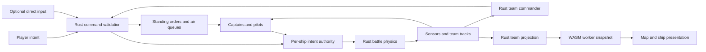

# PvE fleet command: implementation draft

Status: approved direction with user-selected [UI variation D](pve-ui-studies/README.md), incorporating the [Claude Fable review](reviews/pve-fleet-command-fable.md). Implementation is underway; see the [requirement and validation tracker](pve-implementation-status.md) for delivered versus pending behavior. This specification does not itself certify completion.

Source baseline: master commit `5d1453396f9be3a810c8c7abc46f0c10958655ae`, which includes Shōkaku and the shared Rust simulation. This discussion checkout has not been rebased onto that commit. Source links below pin the reviewed baseline; implementation must start from then-current remote master and recheck changed contracts. The retained review describes the original draft, whose hash is recorded there, rather than this revision.

## Product direction

Build a PvE fleet battle in which the player chooses and deploys a fleet, searches for a generated enemy force, and coordinates ships and aircraft to destroy the opposing fleet. Around 30 minutes is a pacing guideline, not a deadline; shorter decisive battles and longer contested battles are acceptable when decisions remain interesting.

Fleet command is the normal way to play this mode. Every friendly ship has a captain who executes standing orders, and ordinary battles must be winnable without direct piloting. Following any friendly ship and optionally taking its helm preserves the existing sailing and gunnery experience; manual control must not be required to compensate for incapable captains.

The essential interaction is: order destroyers to escort a carrier, assign them a priority target, and trust them to keep protecting the carrier while the player commands another part of the fleet.

### The intended battle

Surface forces initially contest a forward engagement and report what they observe. Carrier groups and their escorts operate farther back. The carrier commander chooses between supporting the surface fight and searching for or striking the enemy rear group. A surface breakthrough can expose an approach to the carrier force, and carrier support can change which surface group breaks through.

The player chooses how many suitable escorts stay with the carrier versus reinforce the front. Those ships contribute both defense and forward combat power, so the allocation has an opportunity cost. These are connected fights on one map; neither has to wait for the other to finish. Front and rear are deployment suggestions and tactical roles, not enforced combat lanes or immunity zones. A breakthrough creates an opportunity to intercept or attack; it does not guarantee that a slower ship catches a fleeing carrier.

At the proposed 25 km radius, both sides can reasonably infer likely carrier operating areas. The user accepts this. Spotting should mainly improve current tactical knowledge: raid bearings and strength, fighter coverage, destroyer approaches, escort-screen changes, and the carrier's current position/course. The larger circular area provides maneuvering room; it is not intended to manufacture a long carrier search phase. A probable rear area is not a sensor track and never creates an exact marker or aim solution.

Large decisive strikes are acceptable. The desired decisions are finding a target, assessing the report, choosing an approach, allocating fighters and bombers, and committing through the defense. The user does not require every opening strike to fail or every battle to contain multiple full-wing cycles. Verify that scouting and effective CAP/AA make indiscriminate attacks less reliable; their effectiveness is still a playtest question.

## Decisions and proposed defaults

| Subject | Direction | Status |
| --- | --- | --- |
| Fleet displacement | At most 200,000 metric tonnes per team | User constraint |
| Fleet aircraft | At most 100 embarked aircraft per team, including reserves; no carrier-count limit | User constraint |
| Ship count | At most 15 per team, including any directly controlled ship | Proposed initial value from the user |
| Enemy | Varied, seeded fleet composition and legal deployment | User requirement |
| Friendly deployment | Player places their own units on the map | User requirement |
| Match duration | Around 30 minutes as a guideline; no default time limit, shorter/longer battles allowed | User clarification |
| Enterprise air group | 48 aircraft: 16 fighters, 16 dive bombers, 16 torpedo bombers | Agreed direction |
| Aircraft groups | Four aircraft per group; Enterprise and Shōkaku each have twelve groups | Agreed direction |
| Initial carrier deck | Enterprise and Shōkaku each start with 24 aircraft: two groups of each role; the other 24 start in the hangar | Agreed direction |
| Shōkaku air group | Reduce to 48 aircraft: 16 fighters, 16 dive bombers and 16 torpedo bombers, matching Enterprise's counts and grouping | User decision |
| Airborne aircraft | Remove active-flight limits; inventory and deck operations govern availability | Agreed direction |
| Servicing | Quick deck rearm preserves damage; slower hangar repair keeps groups together | Agreed direction |
| Fuel | Disable endurance effects in PvE; retain configurable counters/policy in the shared engine | No-fuel gameplay agreed; implementation recommendation |
| Spotting | Shared reports, observation and stale contacts for ships and aircraft | Agreed direction |
| Dedicated scouts | Existing aircraft receive search orders; specialist aircraft and ship floatplanes can follow later | Agreed direction |
| Control model | Ordinary play through fleet commands; direct piloting optional. Distinct selection, Follow, Take the helm and Return to fleet command, with tactical pause | User-selected variation D; exact keybindings require audit |
| UI direction | D: B's task-group briefing/deployment and C's selection-based battle controls; aircraft information only in fleet command | User selected; see retained study |
| First mission | Destroy the enemy fleet; no capture or convoy scoring | User decision |
| Defeated ships | Physical loss or permanent combat incapacity; temporary unavailability and immobility alone do not count | User confirmed |
| Battle boundary | Visible boundary with captain turn-back; prototype radius 25 km (50 km diameter) | Visibility confirmed; user-suggested radius recommended for prototype |
| Inventory scope | Both carriers at 48 aircraft, 16/16/16, globally including Custom/online | User confirmed; operating policies remain mode-specific |
| Under-budget fleets | Scale the enemy to the selected friendly fleet, within the same hard limits | User decision |

Variation D settles the UI structure and workflow. Keybindings, scaling formula, damaged-ship boundary handling and initial eligibility still require the planned implementation work. Permanent combat incapacity counting for elimination, global inventory changes, selected-fleet scaling, command sufficiency and no default deadline are settled choices. The requested Claude Fable UI study and user selection are complete; implementation progress is recorded in the status document.

## What exists and what must change

Active Custom and online combat share Rust authority. The path is `Game` → `LocalBattleSession` → worker/`LocalRuntime` → protocol `Session` → `Battle::step`; online workers host the same simulation. TypeScript still supplies port fixtures, migration references, setup adapters and presentation helpers. New combat behavior belongs in `crates/naval-sim`, with addressed commands in `naval-protocol`; do not restart development in the retired TypeScript combat engine. See the [session contract][session-guide] and [Rust implementation status][rust-status]. Some older prose still describes TypeScript behavior; verify current source when they disagree.

Existing foundations worth reusing:

- `FleetControl` has ship ownership, selected-ship control, addressed Move/Hold/Autonomous/Focus and air commands. Movement and fire priority are already independent. Per-ship bot memory and projectile/aircraft attribution survive control changes. Extend these contracts rather than recreating them.
- The deployment planner already supports dragging ships and headings; the existing M camera, aircraft multi-selection and Fleet orders panel supply the interaction starting points.
- Rust aircraft already have finite inventory, serial recovery, per-plane service and hangar-only depleted-group consolidation.

Missing behavior and current incompatibilities:

- Move follows one point with limited throttle; Hold applies zero helm rather than station-keeping. Ordered movement needs routes, speed control, friendly collision avoidance and persistent escort slots.
- All ordinary snapshots expose both fleets and detailed damage. Bots acquire targets from true actors, aircraft follow true target IDs, and unselected bot-controlled carriers start attempting automatic launches after about five seconds. A hidden map alone cannot provide spotting. See [snapshot projection][snapshot-source], [bot targeting][bots-source] and [carrier execution][aviation-source].
- Air commands in the protocol can address any owned carrier, but client helpers use the selected ship and the air map depends on it being a carrier. Add explicit carrier recipients and a friendly Manual air policy independent of helm selection.
- Global rules currently count tonnage, vessels and carriers. Online uses an eight-vessel/two-carrier limit; Custom supports 30 vessels per side. Neither is the proposed PvE policy. Victory currently uses physical losses only and awards greater afloat tonnage at 30 minutes. Disarmed hulls still count. See [current rules][rules-source].
- Setup exposes every enemy, loading can disclose carrier presence, and island lane width depends on fleet sizes. PvE needs a private generated setup and map geometry independent of the hidden roster.
- Local creation draws a new seed; restarting the same generated battle requires explicit saved setup/seed plumbing. The worker scheduler can also run slower than wall time under load, which must be measured separately from mission time.

Recommended first release: local PvE in the existing WASM worker, with tactical pause. Existing online battles continue on server time. Extend one shared simulation with validated per-battle policies; preserve Custom/online rules except for the explicitly authorized global carrier inventory changes. PvE budgets, observations and air logistics remain selected mode policies. Local-only PvE is a scope recommendation, not a new engine.

### Review disposition

Accept the Rust authority correction, team-filtered observations, AI use of tracks, aircraft-budget validation, explicit air policy, and the need to build reliable escorts and sensors before a public PvE mission. Preserve the original gameplay goals of elimination, enemy scaling, equal aircraft roles and no airborne cap.

Qualify these review recommendations:

- Retain an `EndurancePolicy` with an explicit Disabled value for PvE; a long forced-return timer still changes the no-fuel design. The user also clarified that 30 minutes is a guideline, so remove the earlier default deadline/draw proposal.
- The user has chosen to reduce Shōkaku from the authored 72 aircraft to 48, split 16/16/16 like Enterprise. This supersedes both the review's keep-72 recommendation and the intermediate proposed 24/24/24 split. Preserve its aircraft models and expose the authoring/rebuild cost below.
- Launch and recovery estimates and claims about weak interception are hypotheses, not measured battle outcomes. Do not prescribe a 4–8-minute recovery wait or an accuracy buff before a complete sortie test.
- Permanent combat incapacity now counts for PvE elimination by user decision. Audit `combat_lost` carrier phases, ammunition and recoverability semantics before reusing it; approval of the rule does not establish that the existing predicate implements it correctly.
- Aircraft-only prerequisites need not block the first escort prototype. Establish their contracts early and implement them before the carrier slice.
- Keep the roster in its registry. Budget examples are useful; copying all current tonnages or a fixed roster count into this proposal creates another stale catalog.

## Fleet budgets and generation

### One authoritative validator

Extend the trusted Rust fleet validator with a versioned `FleetBudgetPolicy`, and expose its results to setup UI. PvE permits 200,000 tonnes, up to the proposed 15 hulls and 100 embarked aircraft, with no carrier-count constraint. Existing modes retain their selected policy.

- Resolve `definition.hull.massKg` from trusted content and reuse the current explicit integer-kilogram quantization (`match_displacement_kg`), checked summation and invalid-value rejection. Compare against `200_000_000`; convert to tonnes only for display. Do not introduce a second rounding rule in the UI. This uses authored gameplay displacement, whose historical basis may remain approximate.
- Count every selected hull once, regardless of camera focus or direct control.
- Add total aircraft to trusted `FleetEntry`/fleet results and derive it from the resolved air-wing pools. Count every embarked aircraft, including hangar aircraft and future floatplanes; do not count only deck or airborne aircraft. Do not accept a client-supplied cost or inventory count.
- The 100-aircraft cap is a fleet construction limit. It is not an active-aircraft or active-group limit.
- Resolved complements are fixed at setup. The proposed equal-role rebalance must be authored explicitly before the carrier milestone; do not silently trim or change a wing to fit the budget. Future editable wings use the same blueprint/definition format and validator.
- Losses do not unlock purchases, new aircraft or reinforcements during the battle.
- Read eligible definitions from [the preset registry](../src/ships/presets.ts). Do not create another preset roster in mission data or package scripts.
- Invalid, missing or unsupported definitions fail with a specific setup error; they do not count as zero cost.

Budget examples after the agreed 48-aircraft rebalance is authored for both carriers:

| Carrier selection | Aircraft | Aircraft-budget result |
| --- | --- | --- |
| Enterprise | 48 | Legal |
| Two Enterprises | 96 | Legal |
| Shōkaku | 48 | Legal |
| Enterprise + Shōkaku | 96 | Legal |
| Two Shōkakus | 96 | Legal |
| Three of these carriers, in any combination | 144 | Invalid |

Tonnage and hull limits apply independently. Any pair of these rebalanced carriers uses 96 aircraft, leaving four aircraft of allowance. The reviewed runtime still has Shōkaku at 72; the examples above become valid only after its definition is changed. Future light/escort carriers use their own authored capacities and may allow different combinations; do not replace the aircraft budget with a two-carrier limit.

Tonnage is understandable to the player but is not a complete measure of combat strength. Use a private, documented estimate of armament, protection, air capability and role coverage to avoid pathological generated matchups. Do not introduce a second visible currency or secretly buff enemy damage to compensate.

### Generate a coherent enemy

1. Resolve the mission, map and difficulty, then choose a seeded force archetype: surface action, carrier support, or a fast force with heavier support.
2. Choose a target strength envelope under all three limits, scaling to the player's selected fleet. Use its displacement and combat capabilities rather than always spending close to 200,000 tonnes. Start with a narrow estimated-strength band; measure and tune it instead of promising exact balance from tonnage alone.
3. Sample eligible ships with role weights and controlled duplication. Include credible surface combat capability and protect valuable support ships; do not draw fifteen unrelated ships uniformly at random. The current small-hull selection is limited, so repeated Fletchers/corvettes are expected, not generation failures. A tiny friendly fleet must receive an appropriately small opponent, not a forced full carrier task group. A one-preset pool is valid when it can form a legal, playable opponent; fail only when no suitable opponent exists.
4. Validate all budgets and mission capability. Use bounded generation attempts and a legal fallback assembled from available eligible definitions. Report when no valid opponent can be generated rather than looping or relaxing caps.
5. Place task groups inside legal enemy deployment regions using role-appropriate spacing, headings and routes. Randomize layouts, not individual hull positions without coordination.
6. Freeze the enemy roster and initial placement before friendly manual placement begins. Moving a friendly marker must not make enemies counter-deploy or reroll.

Derive separate random streams for mission selection, composition, deployment and AI decisions. Save the seed, generation version, resolved definitions/hashes, placements and setup. The same setup and seed must reproduce the same initial battle. Restart repeats it; New battle explicitly rerolls.

The briefing shows the mission, conditions, deployment regions and coarse intelligence if the scenario supplies it. It does not show the exact enemy roster, markers, fleet tonnage spent or aircraft count. Loading text and camera fitting must not reveal that information either.

### Eligibility and submarines

The completed mode's PvE pool should include supported surface combatants and carriers. The earlier surface-only milestone restricts both friendly selection and enemy generation to surface combatants without air wings. Merchant ships become mission participants for convoy scenarios; an armed merchant is not automatically a sensible random opponent for a battle fleet.

Submarines require an explicit follow-on slice for underwater detection, search orders and useful ASW counterplay before entering the random PvE pool. They remain available in Custom battle. Plan sensor extensibility now; do not make submerged submarines optically visible or introduce an effectively unfindable enemy just to include every preset. This eligibility recommendation requires review before implementation scope is finalized.

## Mission, map and deployment

### First mission: Fleet elimination

The user selected elimination for simplicity. Do not implement a capture zone, control points, convoy requirement or victory by damage score in this first mode.

Detailed rules:

- Confirmed PvE win rule: every opposing ship has a physical loss or permanently lost combat capability. This differs from current Custom/online physical-loss-only rules and is authorized for PvE. Evaluate both teams after the same completed tick; simultaneous elimination is a draw. Reuse audited capability predicates rather than checking a display status string. Immobility alone and temporary reload/service/module unavailability do not eliminate a ship.
- Losing the directly controlled ship is never an automatic defeat. Return to Fleet command while remaining ships continue their orders.
- A working carrier with strike aircraft must not be declared useless solely because its deck guns were destroyed. Capability includes usable air operations and relevant surviving aircraft; distinguish temporary service/reload/damage interruptions from permanent inability to fight.
- Aircraft alone do not keep an eliminated fleet alive. If every home-team ship is lost, conclude the battle without requiring the opponent to hunt scattered aircraft. While friendly ships remain, aircraft from a lost carrier can still finish feasible orders.
- Use no default PvE deadline. Thirty minutes is a pacing guideline; the battle continues while meaningful conflict remains. Optional custom time limits must be explicit before starting and define their own result policy. Diagnose long searches, uncatchable retreat, recovery stalls and cleanup directly rather than ending an active battle at an arbitrary time.
- The authoritative simulation decides victory, but ordinary battle UI only shows confirmed enemy losses and known contacts. Full enemy totals appear in the debrief.

Elimination deliberately leaves a design risk: a carrier can prefer standoff and a fleeing last ship can create a long cleanup phase. Address it first through bounded maps, useful surface engagement opportunities, search orders, varied enemy commitment and carrier strike balance. Do not claim that fog of war or a slower launch queue removes this incentive.

The enemy's surface force should actively seek supported engagements; its carrier should maintain a support position with escorts and reposition under threat rather than continuously flee around the perimeter. This is an explicit PvE behavior choice, not a restriction on player movement or an excuse for suicidal AI. Test player carrier kiting as well as enemy retreat. If that dominates despite tuning, revisit the mode tradeoff with evidence rather than silently adding a capture objective.

Add versioned `MissionRules` to `BattleSetup`, resolved by Rust at creation and recorded with the setup. It defines elimination policy, optional deadline and result, battle bounds and observation policy. Default to today's Custom/online behavior for callers that omit the new profile. Countdown telemetry must read the selected mission rules, not `Rules::default()`. Mode/rules selection is validated by the host; an online player cannot submit arbitrary victory rules. Convoy and sea-control modes remain deferred.

### Scale and legal placements

Start the mixed carrier/surface prototype on a **circular playable area of radius 25 km**, centered at the origin: 50 km diameter and horizontal bounds `x² + z² ≤ 25,000²` in meters. Visual ocean continues beyond it. This replaces the earlier 40 × 40 km square. The circle covers approximately 1,963 km², about 23% more than the old 1,600 km² area, and removes map corners while providing more room for flanking and rear-group maneuver. It does not by itself prevent perimeter kiting. The user suggested this radius; adopt it as the first prototype value, subject to pacing and navigation tests.

Illustrative opening layout along the north–south axis, keeping the earlier engagement distances instead of pushing forces to opposite edges (negative z is north):

| Area | Position relative to map center | Separation from the next group |
| --- | --- | --- |
| Enemy carrier group | z ≈ −16 km | About 8 km to its surface group |
| Enemy forward surface group | z ≈ −8 km | About 16 km to the friendly surface group |
| Friendly forward surface group | z ≈ +8 km | About 8 km to its carrier group |
| Friendly carrier group | z ≈ +16 km | About 9 km to the southern perimeter on the centerline |

Randomize lateral placement and safe headings inside broad legal deployment bands, with roughly 14–18 km between initial fronts, 6–10 km from each front to its own rear, and typically 28–36 km between rear groups. Freeze enemy deployment before friendly placement. Show the player only legal friendly water and general enemy approach information. Do not publish exact enemy carrier coordinates. Likely rear operating areas can be obvious from the map; the table is a test layout, not a discovered target or a promise of strategic concealment. Fleet placement remains the player's choice inside its legal region.

Use several broad routes around offset island groups, leaving maneuvering room for gun engagements and escorts. Avoid a single mandatory central channel, a wall splitting the map, or an unobstructed surface sightline to every rear position. A breakthrough should open an approach or a firing opportunity with forward observation, while the carrier can respond by repositioning, allocating aircraft or drawing escorts back. Fewer escorts at the rear strengthens the front and increases rear vulnerability.

Timing evidence from authored gameplay values at the reviewed Rust baseline: representative combat ships have maximum speeds of roughly 0.8–1.1 km/minute; strike transit uses about 75–85 m/s (4.5–5.1 km/minute). A direct 32 km carrier-to-carrier flight is therefore about 6.3–7.1 minutes; a 24 km carrier-to-opposing-front flight is about 4.7–5.3 minutes. Launch, search, assembly, maneuvers and moving targets add time. These calculations do not establish full-sortie duration. Guns of at least 200 mm currently have an 18 km bot engagement gate, so surface visibility and routes matter more than simply waiting to sail into range.

The current Patrol/loiter command has a 30 km carrier-relative limit; mission-sized search routes cannot inherit it silently. Validate aircraft orders against explicit mission airspace and the selected endurance policy. The existing ±40 km coordinate safety check is not the battle boundary; the 25 km radius circle fits within it, but command, terrain, camera and aircraft-order bounds still need one consistent mission definition. Use radial membership and maneuver/formation clearance for placements and order destinations, not just the circle's enclosing square.

Keep radius 25 km fixed for the first mixed-fleet tests. After calibration, expose smaller preset areas for explicitly surface-only scenarios (starting around 24–28 km across) or larger variants if needed. Select the map family/size before hidden enemy generation using public scenario settings and the selected friendly fleet; never derive geometry from a secret roster. A small map must not silently allow an enemy carrier force that its timings cannot support.

Validate land clearance, hull spacing, region membership and navigable routes into the battle area. Show precise errors beside the affected marker. Role suggestions help without imposing a carrier-count rule or forcing ships into historical formations.

Visible boundaries are confirmed. The implementation default is normal-motion captain turn-back at a clearly displayed inner warning margin, including an overriding safety captain under direct helm. Show the circular limit on the tactical/deployment maps and a restrained proximity cue in ship view. Allow room to turn a whole formation before crossing the outer limit. Define physically consistent handling of disabled engines/rudders during implementation. Do not teleport hulls or silently score an intact ship as sunk. Test disabled engines/rudders and the possibility of a carrier circling the edge indefinitely. A finite area limits search space but does not prove kiting is solved.

Measure time to first meaningful report, first surface exchange, strike opportunities and cleanup. The ordinary front should become active within the first few minutes. Reconnaissance of the rear confirms current positions and defenses, while spotting mobile aircraft and destroyers supplies much of the tactical uncertainty; a long hunt for the carrier is not required. The battle may exceed 30 minutes without failure if meaningful choices continue.

## Fleet command and direct control

### Separate four concepts

| Concept | Meaning |
| --- | --- |
| Commander/team | Owns all friendly ships and can issue legal orders |
| Selection | Units affected by the next fleet order |
| Camera subject | Ship or aircraft being followed; has no command authority |
| Directly controlled actor | Optional single friendly ship receiving manual helm and gunnery input |

Rust already retains stable actor IDs, ownership and dormant captain state. Extend the existing `FleetControl`/`Session` paths; do not swap actor identities. Separate UI selection and camera follow from the selected pilot in `SnapshotSession`/`Game`. Fleet command needs an explicit release of direct control so no selected ship silently loses captain control. Preserve port and Custom/online adapters.

Start PvE in Fleet command with every captain active. Selecting a ship opens its commands; Follow moves the camera while the captain continues. Take command explicitly suspends that ship's order execution and transfers manual helm and the selected weapon controls. Other ships and unselected automatic systems continue operating.

Returning to Fleet command releases manual control and resumes the ship's saved standing order from its current physical position. Taking command of another ship does the same for the previous one. Never reset health, ammunition, weapon training, aircraft, contact memory, damage-control choices or score. Clear held fire/helm input during transfer so a mouse press cannot fire the new ship accidentally.

While manual control is active, fleet orders to that ship may update its saved plan but are visibly marked as waiting for captain control. Do not have two controllers fight for the helm. Destruction of the controlled ship returns the player to Fleet command and leaves other units fighting. A lost escort target puts its escorts into a visible local defensive hold until reassigned; no silent pursuit of the nearest opponent.

Damage and kills are credited to their actual owner IDs and to the friendly team independently of current control. A torpedo fired before switching ships and aircraft launched from a different carrier retain their original attribution. Track personal participation separately if desired.

### Captain autonomy and player responsibility

At the reviewed runtime baseline, individual bots already choose enemy actors, approach/maneuver to preferred engagement distances, aim/fire guns and fitted torpedoes, use automatic AA and react to damage. Those choices are not currently limited by visibility. Move/Hold/Autonomous/Focus exist, but reliable escorts, station-keeping, fleet routes and coordinated task selection do not. The following is proposed PvE behavior, not a claim that it already works.

| Captain handles automatically | Player chooses |
| --- | --- |
| Lookouts, reporting and maintaining observed fire-control solutions | Where to scout, which route/front to contest, and whether to pursue a lost contact |
| Course/speed corrections, formation slots, safe local avoidance and recovery to station | Route, desired speed, formation, escort leader and position |
| Gun target selection among legal local threats, aiming, ammunition choice, reloads and firing | Focus target, weapons hold/free, broad engagement posture |
| AA and a bounded evasive response to a detected torpedo/air threat | Escort allocation and whether to release a screen for an attack |
| Maneuvering for gun arcs and the requested engagement distance within its assigned bounds | A surface Attack order and permission to leave a route/escort station |
| Routine fire/flooding/repair work and warnings about capability loss | Optional damage-control priorities and withdrawal/reassignment |
| Executing an authorized torpedo run, launch solution, finite salvo and recovery maneuver | Torpedo Attack target/approach or explicit permission for opportunistic torpedoes |

Default gun/AA policy is defensive weapons free within the standing movement task. Default torpedo policy is Hold for task: prevent scarce destroyer torpedoes being wasted simply because a contact enters range. A Torpedo Attack authorizes the captain to conduct the run and fire without manual aiming, then return to the saved task or a player-selected rally point. It visibly suspends Escort and warns that the leader is losing part of its screen. A broad opportunistic-torpedo setting can be added without making every salvo a manual action.

An Attack order authorizes engagement maneuver within a shown pursuit area. Captains choose feasible firing arcs and distance according to ship role and the requested task; they must not all close to the old bot's short preferred range. Focus fire changes gun priority only. A ship in Escort can shoot at the focus target when feasible while keeping its leader protected. No order authorizes reading unobserved helm changes, torpedoes or internal enemy damage.

Unassigned ships hold locally and defend. Provide recommended opening orders the player can accept or edit during deployment: a forward route/engagement area and rear escort assignments. Do not silently launch a fleet attack or redistribute escorts. Local safety corrections resume the stored task; strategic retreat, pursuit, new attack commitments and escort reassignment belong to the player. Command-only completion should be tested with normal crew skill and the same weapon physics as direct control.

### Initial ship orders

Movement orders and fire priorities are already separate in the protocol. Preserve that distinction and extend the small initial order set:

| Order | Captain behavior |
| --- | --- |
| Move | Follow waypoints at a requested feasible speed, firing at legal targets without leaving the route |
| Hold area | Station-keep and maneuver for safety/arcs inside the shown area |
| Escort | Maintain a heading-relative slot around a moving friendly leader and a bounded defensive area |
| Attack/pursue | Explicitly maneuver against a team track within shown pursuit bounds; search its last report if lost |
| Torpedo Attack | Execute an authorized run and salvo against a track, then return to the saved task or rally point |
| Focus fire | Prioritize a track for weapons; preserve movement and escort orders |
| Weapons free / hold | Control discretionary firing, with automatic AA permission shown separately |

An escort may turn to unmask guns, avoid a torpedo or prevent a collision, then returns to station. A target leaving the defensive area does not pull it away. Attack explicitly replaces Escort when the player wants to commit a destroyer to a torpedo run.

Implement ship patrol as a looped Route and retreat as an ordinary Move initially. Torpedo Attack can reuse Attack with a weapon/return policy rather than requiring another planner. Defer separate Advance-and-engage and task-group rally/Execute until the basic commands can be trusted. Show defensive/pursuit areas rather than adding numerous aggression sliders.

### Selection, formations and coordinated attacks

- Reuse map selection: click, additive selection and box selection. Provide Ships/Aircraft filters so overlapping markers do not make selection unpredictable.
- Right-click water issues Move; right-click a friendly ship issues Escort. Right-click an enemy contact prioritizes fire while preserving the current movement task; a distinct Attack command permits pursuit.
- Shift appends compatible waypoints/orders. Route editing and Cancel pending action must not erase a fleet's standing orders accidentally.
- Named task groups and numbered control-group shortcuts recall selections. A task group is a command relationship, not merely a current selection or a historical ship squadron.
- Begin with a column and an escort screen; add line abreast after their navigation works. Keep slots stable and cap leader speed to the formation's sustainable speed. Escorts need temporary speed above the leader to regain station; simply capping each escort at leader speed prevents catch-up. A damaged straggler produces an actionable notice and an explicit slow/leave decision.
- Carrier escort slots are relative to the carrier's heading and travel with it. Ships widen or transition formation for narrow passages and reform afterward.
- After the first playable mission, add rally points and Hold until Execute on a task group. Captains report ready, still moving, blocked or unable. Execute starts the maneuver; it does not synchronize physical gun discharges or bypass reloads and firing lanes.
- Temporary collision avoidance has priority over unsafe maneuvers but preserves the standing task. Unreachable routes stop with an explanation instead of repeated grounding.

Tactical pause is recommended for local PvE. It freezes both teams, physics, contact aging, servicing and mission time. Support ship and air orders while paused: remove current client rejection paths, give immediate queue feedback, and validate/revalidate commands through the shared path on resume. Bound queues and show rejected or superseded commands. Existing online sessions continue on server time. Normal-speed play must remain viable; pause helps a new RTS player manage the fleet.

## Spotting and information

### Authoritative observation

The most valuable first-version reports are changing tactical threats, not a mandatory carrier-discovery sequence. Aircraft reports should expose supported estimates of bearing/course, altitude and group size/type; destroyer reports should support tracking a flanking or torpedo approach. Observing the rear can reveal a moved carrier, visible escort gaps or aircraft taking off/landing, but not its hidden air inventory or internal deck queue. Preserve the same contact/loss rules for all types.

A new Rust system produces observations from ships and aircraft and combines them into team tracks. No visibility model exists in the reviewed runtime. Use `sensors`/`tracks` as module names: existing `contacts.rs` already means physical shell/hull contact geometry.

Start with automatic visual lookouts and aircraft observers, with no extra scout aircraft required. Every ship and airborne group observes from its physical position. Higher observers can see over more horizon/terrain, but size, aspect and atmospheric visibility still limit usable reports. GPU fog, camera position, decorative clouds and rendering visibility never decide detection. Later, radar becomes a separate sensor on definitions that actually support it, with equipment damage and its own observation limits; it does not automatically identify every hull.

For each candidate observer/target pair:

1. Query nearby candidates, then check the applicable horizon and line of sight to authored target features. Use terrain height, observer height and visible target profile; a high aircraft can see over an island when the actual geometry permits it.
2. Resolve a continuous observation strength from observer capability, target size/profile/aspect, distance, altitude, daylight and authoritative visibility. Speed/wake, large formations, gunfire and fires can supply evidence only when their CPU-modeled cue is observable. Weather multipliers do not bypass blocked terrain.
3. Accumulate evidence at a deterministic cadence (initial target: once per simulated second). Good close visibility produces a report within roughly one update; marginal long-range evidence may take about 5–15 seconds. Use hysteresis for acquisition/loss, not a random all-or-nothing reveal on each tick. Confirmation delay must not consume most of an incoming aircraft's warning window.
4. Produce only supported estimates: approximate position, bearing/course, broad category and confidence. Classification improves separately from position. Receiving a report does not reveal the target's inventory, exact HP or hidden escorts.
5. Merge observations into the team's knowledge. Use immediate sharing in the first version so the player need not manage radio operators. Future communication delays are optional realism work. Share reports, not access to the hidden actor.

Use these **provisional clear-day visual ranges** for first-acquisition tuning, not historical specifications or sharp reveal circles. Approximate target size and observer capability interpolate between rows; a taller target can be reported beyond the low observer's water horizon if its visible upper works clear it.

| Observer and target | Starting range band |
| --- | --- |
| Surface lookout → large ship/carrier/battleship | 12–14 km |
| Surface lookout → cruiser | 9–12 km |
| Surface lookout → destroyer/corvette | 6–8 km |
| Search aircraft at useful altitude → large ship | 14–18 km |
| Search aircraft → destroyer/corvette | 8–12 km |
| Surface lookout → small low-flying group | 4–6 km |
| Surface lookout → higher/larger incoming group | 7–10 km |
| Fighter observer → another aircraft group | 5–8 km, modified by height/aspect/group size |

These values adapt the common height/size/weather approach described in the [War on the Sea manual](https://cdn.steamstatic.com/steam/apps/1280780/manuals/WarOnTheSea_Manual.pdf), pages 30–32; our distances and timers are independent design proposals. Test large strikes as aggregate visual evidence without multiplying reveal range by aircraft count. Splitting a formation into many UI groups must not make the same physical aircraft harder to detect.

Low aircraft trade search horizon and route visibility for later detection; high scouts see farther and expose themselves sooner. Start with simple search/approach altitude choices, roughly 50–150 m for low flight and 800–1,500 m for an elevated search, and validate their flight/terrain clearance. A single high scout must remain interceptable, and an aircraft observing a carrier at long range should give a coarse report before a precise fire-control fix. With current 75–85 m/s transit, detection at 4–6 km gives roughly 47–80 seconds to the observer's position before subtracting report and attack-setup effects. Forward escorts and CAP extend warning; visual spotting alone does not promise enough time to launch fighters from the deck after every close detection.

Expose fighter patrol stations and interception bounds. A patrol several kilometers ahead of the carrier can discover a scout or incoming raid before the carrier's own lookouts do; a near-deck orbit cannot protect the entire search perimeter. Audit the existing fighter acquisition/anchor leashes against the proposed observation distances. Allow an explicit intercept commitment against an observed scout outside routine CAP bounds, with a visible cost in the coverage left behind. Do not give scouts permanent observation from a range that no reasonable fighter task can contest.

The first surface milestone uses supported daylight/visibility conditions. Actual volumetric cloud concealment, smoke screens, emissions/receivers and detailed radar processing remain extensions. Decorative smoke must not promise concealment that the CPU does not implement. Nearby unobstructed ships in clear conditions should be recognized promptly without a manual binocular action.

### Contact lifecycle

| State | Player and captain knowledge |
| --- | --- |
| Unobserved | No contact or exact position |
| Reported | Bearing or approximate area, observation time and broad category if known |
| Observed/tracked | Improving position/course estimates and identity supported by observations |
| Lost | Frozen last observation plus explicitly estimated movement and growing uncertainty |

Player-facing reports should read like “surface contact, roughly northeast,” then “large warship, estimated course south,” then an identified class if evidence supports it. Exact enemy names are unnecessary for targeting. New contacts show approximate positions and uncertainty, not just perfect icons without labels.

Start with these track defaults for testing: after about 3–5 seconds without observation, mark a contact Lost and stop updating its measured position. Display a separate estimate from the last observed course and speed, with uncertainty growing with age and plausible maneuver. After roughly 60–120 seconds, move stale surface tracks to a subdued last-report marker; retain them in the log instead of erasing the player's knowledge. Fast aircraft tracks become uncertain sooner. Reacquisition must reconcile identities without exposing hidden exact positions. An attacker may search a stale area; entering attack range still requires local target acquisition.

Store observation provenance, time, sensor kind, position/bearing uncertainty and identification confidence separately. Prediction of a lost contact must use the last observed motion, never the hidden actor's new heading. Observers can combine reports; duplicates must not multiply reveal radius. Detection and identification are separate, including uncertain aircraft affiliation.

Losing a reporter does not erase a report already transmitted. It does stop future observations. Shooting down a scout, breaking line of sight and changing course can defeat an incoming search or strike. Attack orders against a lost contact search the reported area; aircraft do not secretly home on a ship by its internal ID.

Surface fire may use an uncertain area estimate and last-known motion. Continuous valid observation improves a firing solution. CPU collision and damage still use the real world, so blind fire can physically hit something without granting omniscient aim assistance.

Use a smaller visual signature for a low aircraft group than a large surface hull as a gameplay starting point, not a universal historical detection rule. Aircraft altitude, formation size and weather matter: higher searches cover more water while becoming more exposed; low approaches trade search coverage for less warning. Maintain useful interception warning in ordinary conditions. Do not give every plane a universal tiny detection radius or let one high scout reveal the entire map.

Existing aircraft receive Search sector/area orders and finite, understandable sweep routes. A command selects the sector, search altitude and reporting/engagement policy; pilots fly the sweep and report automatically. Offer “shadow and report” for scouts, with self-preservation and no automatic strike commitment. Also allow the player to send armed groups toward a probable rear area with an explicit search-and-strike policy: they fly there and may attack compatible targets only after local acquisition. A separate scout visit is not a prerequisite to launching; accepting unknown defenses is a legitimate commitment. Show the route and its recent observed swath/age rather than marking visited water permanently clear. Bombers can scout with payload retained, but spending them on a search sector delays or exposes the strike force.

Ship lookouts operate automatically. Surface groups provide forward reports and observe aircraft crossing their sightlines; aircraft can route around them at a transit cost. Manual binocular use can improve the viewing experience but must not be mandatory for basic crew awareness or defeat fleet fog of war through camera movement. A remote report can appear on the map and support an uncertain firing solution without rendering an unobstructed physical ship through terrain.

### Prevent information leaks through normal play

Create a Rust team view before state leaves the WASM worker. Internal AI consumes the same authorized track knowledge, without converting true actors into perfect tactical targets. Full truth remains internal for physics. `SnapshotSession` must accept appearing/disappearing enemies, opaque track IDs, no selected enemy, and observation-derived condition rather than mandatory full enemy actors.

Design `presentation_value(viewer)` or an equivalent typed projection once. Hosts choose FullKnowledge for existing Custom/online and Team for PvE. An untrusted client cannot request privileged truth. If fog of war is later enabled online, filter metadata, initial baselines, reconnects, events and update frames per viewer before encoding; the current shared frame cannot be reused. Online fog of war and its additional encoding cost are not prerequisites for local PvE.

Audit:

- Target lists, nametags, minimap, tactical map, camera fit/selection, aircraft labels, routes and manifests. Remove default-first-enemy target selection and unconditional target dereferences. Keep generated enemy setup out of ordinary UI state; use neutral loading text and map geometry independent of enemy fleet size. Avoid visible asset-loading changes that announce newly detected carrier types.
- Exact enemy HP, ammunition, modules, damage numbers, enemy `targetId`, `records.scores`, damage logs, `shellHistory`, afloat totals, sunk counts and event sequences. Filter damage/effects events as well as actors. Replace private details with observed condition or confirmed reports; full totals belong in the debrief.
- Radar-only and remote reports: show contact symbols without drawing an unobstructed detailed ship behind terrain or fog. Render physical silhouettes only when the applicable observation permits them; transition contact quality without arbitrary nearby popping.
- Picking, aim assistance, shell/aircraft follow, spectator views, wakes, sound and visual effects. Visible evidence may reveal a bearing or new contact, but not silently expose unrelated hidden details.
- Bot target selection, damage-aware aim helpers, aircraft interception/strike targeting and automatic AA. Sensor validation must precede target acquisition.

The world simulation may access true state for collisions, projectile hits and physically necessary local safety. Tactical decisions must use observations. This is an information boundary for gameplay; a local browser simulation is not a claim of multiplayer anti-cheat security.

## Carrier operations

### Rear-group movement

Historical context: carriers normally operated underway, adjusting their tracks with the tactical situation and flight schedule. Enterprise's [Midway action report](https://www.ibiblio.org/hyperwar/USN/ships/logs/CV/cv6-Midway.html) records maneuvering within an operating area, including 15-knot zigzagging on June 3 and retracing a track during the battle. A [U.S. Navy weather analysis of Midway](https://www.ibiblio.org/hyperwar/USN/rep/NAVAER/Midway/index.html) records U.S. carriers turning away from the enemy into the available wind for launches and recoveries. This motivates movement and steady flight-operation legs; it does not establish the proposed game's distances or require every carrier to steam at maximum speed constantly.

Recommended PvE behavior: the player assigns the carrier a rear operating area or broad patrol route and desired speed. Reuse Route/HoldArea navigation with a carrier operating policy rather than inventing another planner. The captain cruises on broad legs inside the area, avoiding tight continuous circles, land, boundaries and other carriers. An initial operating-area width around 6–8 km is a test value, sized to fit the actual rear water and formation. The carrier does not automatically chase targets, relocate to an unseen safe spot, or move the whole rear force forward with every front-line advance.

Escorts keep moving slots around their assigned carrier, follow its course changes and reform after local avoidance. The screen must leave room for carrier maneuver and aircraft approach; escorts are not welded into a static circle. A suggested rear patrol is available during deployment and can be edited; ordinary operation requires no manual helm. Standing orders, speed or a deliberate stop remain player choices when physically feasible.

For launch/recovery, the captain favors a steady leg and gives the deck scheduler notice of impending turns. For the first version, use a simple turn/steady-deck condition for the short committed takeoff/landing window, with visible delays and a go-around/clear-runway path. Do not require manual wind alignment or globally suspend all deck servicing during a turn. A later wind-over-deck preference can choose heading/speed automatically if it fits the operating area; strict wind thresholds are a separate design proposal, not a current requirement. They must not trap the carrier against a map boundary or recreate long launch lockouts.

A detected imminent attack can trigger bounded local evasion, interrupting committed flight operations safely and then resuming the operating task. Strategic relocation to another rear area, retreat after a front-line collapse, or detaching escorts remains a player decision for the friendly force, supported by a clear threat notice. The enemy commander makes equivalent decisions using its own reports. AirPolicy remains separate: moving the carrier autonomously does not authorize it to launch the entire wing.

### Physical definition versus battle policy

Keep one versioned blueprint/compiled-definition format for carrier equipment, aircraft model IDs, inventory pools, service modules and physical deck geometry. An operational profile references those definitions; it is not a second ship format or a second authoritative inventory.

Add versioned `AirRules` selected by the battle profile: group size, startup allocation, permitted deck capacity within validated physical layout, lift/launch/recovery/service timings, active-flight policy, endurance and consolidation. Store tunable mode policy in a gameplay asset referencing preset IDs only when a carrier-specific override is needed. Resolve it once in Rust, validate against the ship definition, and freeze its version/hash with battle setup. The catalog/rules handshake must cover these assets too. Missing profiles must fail validation or use an explicitly declared default, never an invisible four-flight fallback in PvE.

The global inventory rebalance is authored and rebuilt. Startup and grouping below describe the pending PvE operating profile:

| Carrier | Previous fighter/dive/torpedo pools | Current authored pools | PvE deck/hangar startup | Status |
| --- | --- | --- | --- | --- |
| Enterprise | 18 / 18 / 12 (48 total) | 16 / 16 / 16 | 24 / 24 | Inventory rebuilt; operating profile pending |
| Shōkaku | 18 / 27 / 27 (72 total) | 16 / 16 / 16 (48 total) | 24 / 24 | Inventory rebuilt; operating profile pending |

At group size four, the agreed pools produce twelve groups on each carrier, four per role. Both carriers start six groups on deck and six below. Matching counts, grouping and startup does not replace Japanese aircraft models with American ones or imply equal combat effectiveness; their payloads and flight performance still need balance testing. Keeping current pools instead produces partial groups and does not meet the agreed inventory design.

Changing inventory pools changes compiled definitions and their content hashes: schedule affected `ship:compile`, `ship:build`, `ship:check`, model acceptance and manifest updates. Operating-policy edits should not require rebuilding geometry unless they exceed its validated capabilities. Preserve stable pool/socket IDs; do not patch generated JSON/GLB hashes. The user explicitly chose a global inventory change: author both shared presets at 48 aircraft, split 16/16/16, including Custom and online. Do not create PvE-only inventory fits for this rebalance. Group size, deck startup and other operating policies remain independently selected by mode; validate how existing modes group the revised pools and display partial groups. Record the intended Custom/online balance change and test the revised defaults there.

Other carrier differences remain meaningful: aircraft types and payloads, survivability, speed, service-module dependencies, deck datums and validated parking geometry. Enterprise currently depends on `magazine-forward`; Shōkaku uses `aviation-service`. Japanese folding hinges are not all modeled, so a nominal 24-slot deck still requires a physical layout review.

### Inventory and deck

- Enterprise and Shōkaku each have twelve stable four-plane groups; four groups per role. Two of each role start on deck and two in the hangar.
- Each carrier's deck occupancy limit is 24 individual aircraft, including parked aircraft, aircraft undergoing deck service, taxiing aircraft and aircraft still in their takeoff run. Six is the initial number of full groups on deck, not a replacement airborne-group limit.
- Future carriers author physical inventories and deck layouts through the same definition format and resolve operating rates through the selected profile. Smaller groups or specialist aircraft must not break counting.
- Set the PvE active-flight policy to Unlimited in every admission path and remove the cap from PvE telemetry/HUD. Parameterize current hard-coded admission and schema limits; preserve legacy values for modes still using them. Explicitly validate/migrate the new profile rather than globally deleting a shared field.
- Bring up is a timed, cancellable group order using shared lift/handling capacity. It does not automatically launch the group. Let players queue the operation and choose its priority.
- Deck reservations prevent lifts from consuming space already committed to incoming aircraft. Distinguish reserved capacity from physically occupied positions in telemetry.
- Aircraft transitions retain individual identities and health. Never duplicate inventory while moving it between hangar, lift, deck and air.
- Build and review actual deck positions, taxi paths and a clear launch/recovery lane. Twenty-four numerically legal slots are insufficient if wings, hull fittings or moving aircraft overlap.

### Launch, recovery and service

Provisional playtest inputs: 15–20 seconds to launch four aircraft, 20–30 seconds to raise a group, 30–45 seconds for deck rearm and 60–120 seconds for hangar repair. One handling queue governs lifts; raising aircraft may overlap launches when space and paths permit. Measure the combined launch/transit/attack/recovery/service cycle before accepting any timer. The review's multi-minute full-wing estimates are unmeasured, and launch/lift overlap changes the sum.

Landings take a short runway reservation when aircraft commit to final approach, including clearance after touchdown. Distant returning flights do not suspend takeoffs. Prefer short group recovery batches so a stream of arrivals cannot starve launches indefinitely. Show the current deck task and next queued task.

Once a group has recovered, offer:

- Rearm on deck: restores ammunition/payload, retains damage and occupies deck capacity.
- Repair in hangar: transfers the whole surviving group below, restores weapons and repairs up to the existing service repair ceiling initially; it then requires another Bring up operation.

Minor damage does not mandate hangar repair. Health remains per aircraft, but normal commands do not split a group. A group waits for its surviving members to finish recovery before a group service/launch decision completes. Severely damaged individual aircraft can still return early; the group identity persists and the remainder is shown as unavailable until regrouped. Do not spawn replacements for losses.

Default to a visible Balanced deck policy: reserve near-term landing capacity, alternate bounded launch/recovery batches, and automatically send recovered or parked whole groups below when arrivals need space. Show and allow changes to the next task; a pin cannot silently create a deadlock, so reject unsafe pins with an explanation. Capacity must be freed before final approach and lifts must fairly serve moves down as well as up. No player intervention should be required to recover an entire surviving wing onto a smaller deck.

Represent reservation, transfer, parked/rearming, queued/launching, airborne, recovering, hangar repair and lost locations explicitly. Group readiness summarizes individual states. An early returning member retains its group ID while the remainder finishes/returns; show why the group cannot launch and allow recall of its remaining members. Transfers and deck clearing must not wait for an airborne member and deadlock capacity. Cancellation and service damage release or retain reservations consistently. A damaged service module produces Suspended with the affected queues visible. Wrecks release occupancy according to their defined clearance state; never duplicate inventory.

Keep flight-time counters and use an explicit Disabled endurance policy in initial PvE. It disables exhaustion loss, time-based recall, low-endurance order rejection and endurance-based recovery priority/UI in this mode. Preserve return for empty weapons, critical damage and explicit recall. Do not use a 20-minute return timer as a substitute for no fuel. Long unengaged patrols remain possible; enabling a future endurance constraint is a separate gameplay decision.

No cross-carrier recovery in the first version. If a carrier is lost or permanently cannot recover aircraft, surviving planes may finish feasible combat orders while the team remains in battle. With no feasible mission/recovery left, mark them unavailable and resolve an explicit terminal loss/withdrawal state; do not orbit a wreck forever or conjure a new home. This terminal handling is a proposal to validate with the carrier-loss slice. Temporary deck failure may keep a visible marshal queue. Aircraft alone cannot prevent fleet elimination; diversion is a later extension.

Group consolidation after losses remains a hangar-only operation between compatible models/roles. Preserve aircraft IDs and surviving group IDs; if consolidation changes a selection or task group, surface the change and repair references. Do not automatically shuffle aircraft across active groups.

### Reconnaissance and decisive-strike balance gate

The user accepts large, potentially decisive strikes. Success means the attack benefits from reconnaissance, target selection, approach planning, fighter allocation and a defensible commitment. It does not require a surviving target or a counterstrike in every battle.

Spotting removes today's exact known-target opening rush: no precise enemy carrier position at setup, no attack homing to unobserved actor IDs, and useful stale reports. The enemy rear area may still be predictable within a 25 km radius map. The important uncertainty is the current target track, raid/fighter activity and escort disposition; success does not require a prolonged search for the carrier. Effective AA escorts and CAP then impose costs on flying into a defended group. The player can concentrate escorts around the carrier or send more surface strength forward; neither allocation should be free. AA is directional, range-, ammunition- and damage-dependent, so test protected approaches and weak sectors instead of treating a fleet as a binary AA shield.

Launching an entire wing can be a reasonable opening if it is split among search, CAP, escort and attack tasks. Bombers can search, but their search route, visibility, payload and exposure create tradeoffs. The failed design would be an indiscriminate launch/search/attack policy that reliably wins regardless of intelligence quality, escort allocation or approach. No forced deck reserve, mandatory second full-wing cycle or arbitrary strike-size limit is a success criterion.

Preserve this as an unresolved empirical question: real observation rules and meaningful defenses may alleviate the opening problem enough. Slower launches alone cannot establish it; neither can per-burst AA hit percentages. Run the paired reconnaissance/commitment tests below using coordinated enemy defense. Tune information quality, response warning, interception and approach effects from outcomes. Serial recovery creates later opportunities when both sides remain effective, but must stay responsive. Keep endurance disabled unless the user later chooses a different rule.

## Enemy and friendly captain architecture

Start with two decision layers in Rust: a small team commander assigns orders to task groups using its tracks; existing captains/pilots execute those persistent orders with local safety and fire control. A common order representation and validation rules connect them. Order state/queues need not become a separate planner. Human orders enter via authenticated `Session`; enemy decisions must not bypass recipient, track or role validation.

Implement commander behavior as a few understandable doctrines: search without contacts, commit a supported surface group to an observed engagement, keep carrier/support groups behind an escort screen, and reposition when a reported threat closes. In mixed battles choose between helping the surface front and scouting/hunting the rear, using known opportunities and escort commitments. A breached front prompts rear repositioning, aircraft support or escort reassignment rather than an omniscient immediate escape. The surface mission needs search/engage behavior before carriers are added.

Friendly unassigned ships hold locally and defend. Set friendly carrier `AirPolicy::Manual` independent of whether the carrier is selected or piloted; other ships must not begin automatic launches when the player switches camera or takes another helm. Optional automatic air management is an explicit setting. Custom/online retain their existing defaults until separately changed.

Difficulty changes reaction, search decisions, coordination and existing crew skill. Both teams use the same selected budgets, sensors and weapon physics. Do not read hidden friendly commands or positions. Captains may prioritize a known combat-capable threat over a confirmed disarmed hull, without learning private damage state.

## Interface brief

The user selected **variation D** from Claude Fable's completed [interactive study](pve-ui-studies/index.html#d/briefing). The retained [decision and provenance](pve-ui-studies/README.md) identify the exact approved artifact. D uses B's task-group layout for briefing/fleet selection and deployment, and C's selection-based layout for fleet command, contact response, air operations, follow/helm and results. The earlier [design handoff](pve-ui-fable-handoff.md) is historical where it differs from this choice. The design-selection prerequisite is complete; the study remains a standalone prototype, not implemented gameplay.

Implement the selected layout and interaction structure using real simulation state. The study frame, variation/screen/demo selectors, preview-result controls and accelerated mock clock are not production controls. Preserve the actual map, sea and ships rather than reproducing the study's illustrative chart/ship scene as the renderer. Keybindings, dense-map label handling and compact layouts require the planned checks without reopening the selected direction.

Audience: a desktop player familiar with direct ship control but new to RTS fleet management. Extend the existing naval instrument styling in [DESIGN.md](../DESIGN.md); the sea, ships and contact geometry remain the main view. This is an extension of the existing map and setup surfaces, not a new visual identity.

The primary loop is Briefing → Fleet selection → Friendly deployment/opening orders → Fleet command → optional Follow/Take command → Results.

- Fleet selection shows live tonnage, ship and aircraft budgets, including exact overages. The enemy roster editor is replaced by mission intelligence and difficulty in PvE.
- Deployment shows friendly legal regions, coastlines and approach routes, and supports moving a whole formation. Enemy positions never appear as editable markers.
- Extend M into Fleet command for any fleet, including one without carriers and one whose initially selected ship has sunk. Use the existing camera transition and reduced-motion behavior.
- A compact friendly roster shows current task and important exceptions. Selection reveals relevant orders, planned paths, station areas and observed target information.
- Aircraft groups from all friendly carriers are commandable without taking direct control of those carriers. Filter by carrier/role and select multiple groups; avoid rendering every per-aircraft detail permanently.
- In variation D's follow view, hide carrier aircraft information, the Air toggle, aircraft row and deck counts. Return to fleet command in one action to manage aircraft. A surface-ship selection within fleet command does not hide access to aircraft from any owned carrier. This supersedes the original handoff's follow-view aircraft-control requirement.
- Selection, camera follow and direct control have distinct visible states. Keep Take command and Return to fleet command explicit. Ordinary selection must never commandeer a ship.
- Examples of actionable feedback: “Escorting Enterprise · Holding port station”, “Target outside escort area”, “Route blocked”, “Waiting for landing clearance”, and “Contact lost · Searching last report”.
- Multi-unit commands show accepted units and specific reasons for partial rejection. Preserve valid existing orders for rejected units.
- Show tactical pause prominently. Keyboard and pointer alternatives cover selection, routes and commands; modifiers are accelerators rather than the only way to operate.
- Audit current weapon-number, aircraft-number, map and submarine keybindings before assigning RTS shortcuts. Context changes must not fire weapons or issue hidden orders.
- On smaller screens, prioritize selection, the next action and warnings; collapse manifests and task-group details. Do not require hover to read essential contact age, order failure or deck state.
- Keep animations subordinate to accurate selection/route positions. Text and symbols accompany color for contact quality, task state and damage.

## Technical boundaries and likely files

Direct control changes intent, not identity or available information. Proposed names describe responsibilities; do not create a module for every row mechanically.

| Boundary | Current extension or proposed seam | Responsibility |
| --- | --- | --- |
| Mission and fleet policy | `naval-sim/src/rules.rs`, `battle.rs`; proposed `mission.rs` | Versioned per-battle finish/bounds/visibility/air policies; trusted tonnage and aircraft validation |
| Generated scenario | Proposed `naval-sim/src/scenario.rs`, existing catalog/environment | Bounded enemy composition/placement, explicit map geometry, saved seed and setup |
| Commands and control | `naval-protocol/src/lib.rs`, `session.rs`, `naval-sim/src/battle.rs` | Ownership, release/take helm, routes/escort/focus, weapons and air policy, validation |
| Captain navigation | `naval-sim/src/bots.rs`, existing environment/avoidance helpers | Station-keeping, catch-up, stable slots, turn-back and local safety |
| Observation | Proposed `naval-sim/src/sensors.rs` / `tracks.rs` | Authored sensor observations, last-known estimates and team memory |
| Legal view | `naval-sim/src/snapshot.rs`, `naval-wasm/src/lib.rs` | Team-filtered metadata/state/events before leaving the worker |
| Fleet AI | Proposed `naval-sim/src/commander.rs`, existing bots/pilots | Search and tactical group orders driven by tracks |
| Air logistics | `naval-sim/src/aviation.rs`, `aviation_step.rs`, `aircraft*.rs` | Resolved rules, inventory locations, deck reservations, servicing and loss handling |
| Client session | `src/game/session/LocalBattleSession.ts`, `SnapshotSession.ts`, generated protocol types | Local setup/restart/pause, addressed commands and observation-based renderer state |
| Control and UI | `Game.ts`, `InputController.ts`, `BattlefieldCamera.ts`, `FleetOrders`, setup/planner/HUD/chart/air components | Independent selection/follow/pilot, feedback and fleet commands |
| Ship authoring | Existing blueprint/compiler/catalog/original recipes | Single format for equipment, inventory, sensors and validated physical layout |
| Mode tuning | Versioned gameplay policy assets | Operating values validated against definitions and covered by setup/content compatibility |

Use stable actor/group/track IDs and generated tagged command types. Sender ownership comes from the authenticated session, not a trusted client team field. Validate recipients, command sequence, coordinates, track visibility/age and role compatibility. Invalid or paused orders must preserve existing tasks and provide a reason; queuing does not promise future readiness.

Resolve profile versions once when creating the battle. Freeze resolved definitions, mission/air policy hashes, seed, generator version and placement for Restart. Reset contacts, events, commands, queues, AI memory, control assignments and outcomes together. Keep map generation, fleet composition and tactical decisions on separate seeded streams.

Rust `contacts.rs` remains physical collision geometry. Full truth stays in physics; tracks constrain tactical targeting and player-visible projection. New local modes must not request online protocol or rendering code to simulate combat independently.

Changes to payload shape require generated ts-rs types and an explicit protocol/build/rules compatibility assessment. New optional defaulted fields can preserve old behavior, but do not assume they preserve serialized bytes. Preserve existing frozen behavior fixtures where possible; deliberately version/update contract fixtures when the contract actually changes. Never refresh fixtures just to hide a regression.

## Implementation sequence

Establish these small contracts where first needed: per-battle MissionRules/AirRules with legacy defaults; an explicit legal-view policy; trusted aircraft totals; saved seed/setup; and per-ship AirPolicy/all-carrier command addressing. Implement observation filtering with tracks, rather than shipping an empty projection wrapper as fog of war. Carrier-specific tuning and rebuild work are prerequisites to carriers, not to the first escort test.

| Slice | Work and dependency | Completion evidence |
| --- | --- | --- |
| 1. Reliable fleet command | Reuse ownership and standing orders; separate map selection/follow from taking/releasing helm. Add Route, HoldArea, Escort, Focus and weapons policy; navigation avoidance and catch-up; map available to any fleet; local pause queue. | A carrier with air operations disabled and three destroyers can turn and traverse an island passage while escorts keep station. Focus never causes pursuit. Helm takeover/resume preserves state. This is a development scenario, not the public PvE mode. |
| 2. Sensors, tracks and legal views | Visual sensors in supported daylight/terrain conditions, track lifecycle, Attack/pursue with torpedo/return policy, search/reacquisition, and projection inside Rust/WASM. All surface AI and player targeting consume tracks; wire the same boundary for aviation/AA before enabling carriers. | Hidden movements/damage cannot change legal observations or tactical choices without a permitted cue. A fleet searches rather than steering toward an unseen enemy; stale targeting searches the reported area. |
| 3. Surface-only PvE elimination | Mission policy with permanent combat incapacity counting for elimination, no default deadline and visible circular bounds; trusted budgets; seed/restart; scaled generated surface opponents; friendly deployment; roster-independent geography/loading; minimal enemy search/engage commander. | A selected small fleet can deploy, find, fight and finish a proportionate opponent on the supported maps. Restart repeats and New battle rerolls. Fully playable through fleet commands with optional helm. This is the smallest public playable mission. |
| 4. Carrier logistics and information | AirRules/profile validation; authored equal-role inventories and required asset rebuilds; four-plane groups, startup deck/hangar allocation, no active cap/endurance, timed handling, recovery and default clearing; Manual air policy and all-carrier commands. Complete aircraft/AA track use. | Enterprise and Shōkaku each complete conserved launch/attack/recovery/rearm/relaunch cycles. Full-deck arrivals and early returning group members resolve without intervention or duplicate IDs. No auto-launch on ship switching or target homing through fog. |
| 5. Combined fleet tactics | Enable carriers in generated missions only after budget/data validation. Add rear operating-area movement with a following escort screen, search/strike/CAP doctrine, loss handling and counterstrikes; role/carrier filters and task-group controls. | Surface-only, one-sided carrier and opposing-carrier battles remain playable. Tests exercise forward/rear escort allocation, support versus carrier hunting, surface breakthrough and reconnaissance-informed decisive strikes. |
| 6. Coordination, polish and release | Add rally/Execute if useful; finish all eligible ship controls/death transitions, contact feedback and debrief. Tune generation, observation, air lethality, logistics and cleanup; validate browser performance and regressions. | Measured outcomes across seeds, passing required checks, and a novice can complete the intended loop without repeatedly repairing orders. |

Carrier scope does not delay proving the escort interaction or the surface mission. Conversely, the final requested mode is not complete at the surface-only milestone: both current carriers and their new logistics must pass the later slices.

## Validation and acceptance

### Automated checks with behavioral value

| Area | Required scenarios |
| --- | --- |
| Budgets | Exactly 200,000 tonnes/15 ships/100 aircraft and each overage; reserve aircraft; duplicates; missing/invalid definitions; rebalanced Enterprise + Shōkaku accepted at 96 aircraft, three such carriers rejected at 144; legacy 72-aircraft Shōkaku never silently counted as 48; switching cannot change costs. Use a test-only valid definition for exact aircraft totals the current roster cannot form |
| Generation | Many fixed seeds stay legal and navigable; same seed/setup reproduces; friendly redeployment does not reroll enemy; bounded failure with a restricted eligible pool |
| Orders | Escort plus focus fire, authorized torpedo run/return, held torpedoes, detected-threat-only evasion, pursuit bounds, target loss/destruction, manual override/resume, sunk controlled ship, unreachable routes, pause queue and partial acceptance |
| Formations | Rear patrol and moving escort screen, carrier turns/steady flight legs, detected-threat evasion and resumption, two nearby carrier groups, slow/damaged member, narrow passage, collision avoidance and re-forming with stable slots |
| Contacts | Terrain and visibility changes, high/low aircraft, repeated acquisition, last-known uncertainty, reporter loss, no camera-derived observations; radar without identification when the radar extension is enabled |
| Information boundary | Isolated hidden-enemy changes with no sensor/physical cue leave normalized legal observations and tactical choices unchanged; exclude clock/transport counters. Also test permitted indirect cues separately. Audit setup/baselines/events/records, logs, picking, follow cameras and AA |
| Air operations | Inventory conservation and unique IDs; more than four groups; both carriers; timed handling; full deck plus arrivals; early member return; interrupted transfers; damaged service module; group consolidation references; Disabled endurance; carrier loss |
| Mission | Surface-only, asymmetric/both-carrier fleets, simultaneous losses, immobile but armed hull, temporary service damage, permanent capability loss, ammunition exhaustion, boundary behavior, no default termination at 30 minutes, explicit optional deadline, aircraft after carrier/fleet loss |
| Compatibility | Port inspection, Custom battle, existing weapon/aircraft commands, damage attribution, reset and deterministic replay |

### Playtest questions

- Can a new player order a carrier escort and leave it alone for several minutes?
- Can the player win without piloting a ship, and enjoy taking direct control without neglecting the fleet?
- Do surface guns, torpedoes and maneuver contribute materially to victory in carrier battles?
- Can contacts be lost and reacquired through understandable decisions, without nearby ships disappearing arbitrarily?
- Do reconnaissance, escort allocation and approach change the result of a large strike? Can a well-planned decisive attack win while an indiscriminate attack meets useful resistance?
- Can launching the wing early support distinct search, CAP and strike choices without making every mission the same automatic carrier rush?
- Does the player spend time choosing targets, routes and servicing priorities rather than repeatedly repairing orders or waiting on a frozen deck?
- Do missions remain engaging when they finish earlier or later than 30 minutes, without a default cutoff or artificial health inflation?
- Can both fleets find and finish a scattered opponent without an excessive cleanup phase? Does carrier kiting dominate even when the fleet commander behaves sensibly?

Run paired tests with the same fleets, map, seed and difficulty: (A) an indiscriminate full-wing search/attack; (B) reconnaissance followed by a concentrated escorted strike; (C) carrier support for a stronger forward surface commitment. Vary rear escort allocation, CAP, approach direction, stale reports, carrier movement and surface breakthroughs. Include trials where both commanders can infer the likely rear area: tracking raids, fighters and destroyers must still alter useful decisions. Include full early launches with different mission assignments. Compare against coordinated contact-driven defense, not only the old five-second auto-launch script. No strategy is required to lose merely because it commits many aircraft.

Record first contact, first surface engagement/strike, survivability by defended/undefended target, losses by cause, deck and marshal waits, observation continuity, order failures, cleanup duration, inactivity and outcomes. Initial investigation triggers, not certified balance requirements:

| Measure | Investigate when |
| --- | --- |
| Repeat strikes | Both sides remain effective but surviving strike groups spend most of the remaining engagement stuck in recovery/service; a decisive first strike is not itself a failure |
| Surface relevance | Forward intelligence, a breakthrough or moving escorts between front/rear rarely changes target choice or outcome |
| Defended target survival | CAP/AA defense seldom changes strike effectiveness enough to justify its cost; per-burst hit percentages alone do not establish this |
| Deck usability | Median recovery wait exceeds transit time, or long repeated takeoff lockouts make orders unresponsive |
| Scout persistence | One scout maintains an accurate carrier track for most of the battle despite plausible interception opportunities |
| Cleanup | Typical time from decisive loss of enemy combat capability to conclusion exceeds about five minutes |
| Engagement pacing | Long periods offer no useful scouting, maneuver, attack or service decision; exceeding 30 minutes alone is not a failure |
| Commands | New players repeatedly reissue basic escort/movement tasks instead of making tactical decisions |

If an indiscriminate attack consistently succeeds regardless of reconnaissance and defensive decisions, document why before changing rules. A large well-planned strike consistently beating weak defense is acceptable. No-fuel flight and unlimited airborne groups remain requirements unless the user chooses to revise them.

### Performance, visuals and repository checks

Stress up to 30 ships and 200 aircraft combined, all available aircraft airborne, using legal resolved fixtures; use explicit diagnostic-only fixtures when the production roster cannot reach a boundary. Measure the actual browser WASM worker, serialization/projection, sensor queries, rendering, memory and queue growth through a full mission on named hardware. Record both simulated and wall time and a diagnostic simulation-rate ratio; sustained rate below 0.95 is an initial investigation trigger. Existing native and short Custom stress runs do not establish this target. Optimize spatial queries, observation cadence, rendering LODs and bounded history rather than hiding load behind an airborne cap.

Review map/ship camera transitions, fog-of-war silhouettes, readable contact ages, formation paths, order acknowledgements and actual deck articulation at desktop and compact sizes. Retain seeded diagnostics and captures for the implementation under review.

Follow the ship pipeline validation matrix at the implementation baseline. Run relevant Rust unit/integration tests, `bun run multiplayer:check` for shared native/WASM/protocol behavior, relevant TypeScript/session tests and `bun run build`. Use `bun run multiplayer:fixtures` only for an intentional reviewed fixture/contract update. Shared default behavior remains covered by compatibility regressions. Definition/hash changes require affected compile/build/check and model acceptance; retain evidence as prescribed by the current pipeline. This documentation revision does not change simulation, definitions or model outputs.

For separate implementation worktrees or integration, first follow [the integration workflow](integration-workflow.md). Resolve durable authoring inputs before stale outputs; never select a binary side or rewrite hashes to suppress validation failures.

## Implementation details and design handoff

Most of the review's nine questions are implementation recommendations, not reasons to restart the design discussion. Proceed in the plan with local WASM PvE, mode-gated shared behavior, configurable but Disabled endurance, separate operational policy, and the proposed 15-hull cap. The user has clarified that direct piloting should generally be unnecessary, decisive strikes are acceptable, surface/rear allocation supplies the tactical structure, and 30 minutes is not a deadline. Repeated small-hull presets are acceptable; adding roster variety is not a prerequisite.

Remaining work to resolve in the affected slice:

1. Implement variation D's selected selection/follow/helm workflow and validate the captain/commander boundary, especially held torpedoes and authorized attack/return tasks. Winning without direct piloting and the follow-view aircraft-information restriction are settled. Audit exact keybindings against existing controls.
2. Implement the confirmed permanent-combat-incapacity elimination rule with audited carrier, ammunition and recoverability semantics. This is no longer an open product decision; edge cases still need tests. There is no default deadline.
3. Prototype the recommended 25 km radius with confirmed visible boundaries and normal-motion captain turn-back. Define damaged-ship exceptions and formation clearance; a circular map alone does not solve perimeter kiting.
4. Apply the confirmed global 48-aircraft, 16/16/16 inventory change to both shared presets through the existing authoring pipeline, and validate Custom/online compatibility. Keep PvE operating policies distinct. No further inventory-scope confirmation is needed.

Tune enemy-strength estimates, sensor ranges, supported map/weather set, deck timings and supported hardware from evidence. None of these values has been validated by this document or the review. No fuel-management decision needs reopening unless playtests demonstrate the unresolved free-loiter problem.

Deferred features: convoy and sea-control missions, online/cooperative PvE and online fog of war, campaign economy, mid-battle construction/reinforcements, specialist scouts, ship floatplanes, cross-carrier diversion, fuel management, volumetric cloud concealment, radar-emission warfare and submarine/ASW missions. Network authority already exists; reuse its Rust contracts. The shared definition, observation and order boundaries must accommodate future work without making it a dependency of the first PvE mode.

[session-guide]: https://github.com/goldflag/ship-game/blob/5d1453396f9be3a810c8c7abc46f0c10958655ae/src/game/session/README.md
[rust-status]: https://github.com/goldflag/ship-game/blob/5d1453396f9be3a810c8c7abc46f0c10958655ae/docs/rust-multiplayer-implementation.md
[snapshot-source]: https://github.com/goldflag/ship-game/blob/5d1453396f9be3a810c8c7abc46f0c10958655ae/crates/naval-sim/src/snapshot.rs
[bots-source]: https://github.com/goldflag/ship-game/blob/5d1453396f9be3a810c8c7abc46f0c10958655ae/crates/naval-sim/src/bots.rs
[aviation-source]: https://github.com/goldflag/ship-game/blob/5d1453396f9be3a810c8c7abc46f0c10958655ae/crates/naval-sim/src/aviation_step.rs
[rules-source]: https://github.com/goldflag/ship-game/blob/5d1453396f9be3a810c8c7abc46f0c10958655ae/crates/naval-sim/src/rules.rs
