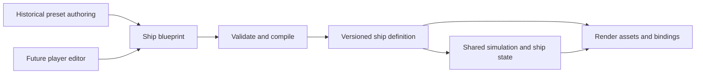

# Ship production, combat, and construction

Draft proposal · 2026-09-04

Use Bismarck to establish one ship format that supports historical presets, combat, and player construction. Build each ship as an assembly with explicit physical and gameplay properties. Generate the visual asset and simulation data from that assembly.

Working assumption pending the owner's preference: accessible simulation with armor, internal systems, ballistics, and flooding, using simplified calculations. The roadmap below is a proposal; combat, networking, and an editor are not implemented by this document.

## What exists today

| Evidence inspected | Finding | Consequence |
| --- | --- | --- |
| `/Users/bill/models/bismarck/README.md` and `dimensions.json` | The exterior has dimensional constraints and orthographic references. Hull sections, several structures, fittings, and underwater details are acknowledged approximations. Interiors are omitted. | Improve the existing reconstruction against specific evidence; first establish which discrepancies actually exist. |
| `/Users/bill/models/bismarck/build_bismarck.py` | Rebuildable Python generator; named turret pieces, with barrel positions constructed in world coordinates. No articulated turret hierarchy in the generator. | Add explicit local coordinate frames and assembly ownership in the source. Preserving existing pieces alone will not create correct pivots. |
| [`scripts/export-bismarck.py`](../scripts/export-bismarck.py) | Removes non-mesh/non-curve objects, joins meshes by collection, resets origins to the scene origin. | Change export rules before implementing articulation. Empty pivot/socket objects must survive. |
| `public/models/bismarck.glb`, inspected directly | 11 mesh nodes, including one combined main battery node; no child hierarchy or animation clips. | Four turrets cannot currently be controlled as four node assemblies. Procedural aiming will not require animation clips, but does require separate joints. |
| [`src/simulation/ship.ts`](../src/simulation/ship.ts) | Renderer-independent, serializable movement at 60 Hz. Handling uses a single `BISMARCK` constant. | Retain this separation; pass a ship definition into the simulation as additional ships arrive. |
| [`src/game/Game.ts`](../src/game/Game.ts) | Loads one GLB. GPU water buoyancy controls visible height and tilt; simulation only owns X/Z movement and heading. | Combat needs an authoritative three-dimensional pose shared by guns, collision, and rendering. |

The original Blender source is outside this repository. The production workflow should version the generator, definitions, and export contract in the project, with an explicit location/version or content hash for large source assets. Preserve the original model as the baseline.

## 1. Reliable model production

### Reference package for each historical ship

Choose a specific configuration before modeling: ship, date/refit, equipment, and reference loading condition. Record reference-game version, hull upgrade, and equipment configuration separately. A same-name ship from another game is a comparison reference; it is not automatically the chosen historical configuration.

For each ship, maintain:

- Source register: source, author, date, view/configuration, what it supports, and confidence.
- Measured specification: overall and waterline dimensions, draft/load condition, turret centers, deck heights, funnel and mast positions, and equipment inventory. Each constraint includes units, datum, source, uncertainty, and acceptance tolerance.
- Shape references: profile, plan, bow, stern, and hull sections where available. Prefer original plans and documented dimensions for historical geometry. Published reconstructions fill gaps with stated confidence.
- Comparison set: matched views of our model and the reference, plus a discrepancy log with evidence and resolution.
- Explicit unknowns: distinguish measured features, interpreted shapes, and deliberate gameplay simplifications. Missing interior evidence stays unresolved rather than being inferred from an exterior model.

[GameModels3D](https://gamemodels3d.com/) advertises vehicle models, characteristics, modules, and crew. Its public [World of Warships catalog](https://gamemodels3d.com/games/worldofwarships/) is discoverable. The individual Bismarck viewer could not be inspected through the research fetch in this session; account-specific viewing, downloading, layer controls, and measurement features remain unverified.

Use the owner's available reference access in either of these ways:

| Access | Review workflow |
| --- | --- |
| Browser viewer | Capture repeatable views where its controls allow. Match orientation, projection, scale, waterline, and configuration. If projection cannot be matched, use the view for qualitative review and use documented dimensions for measurements. |
| Reference files available for this use | Inspect in an isolated reference scene; align with rigid transforms and a documented uniform scale. Compare landmarks, silhouettes, and selected cross-sections. Retain provenance and coordinate conversion. |

Keep our geometry, topology, UVs, and textures independently authored. Do not make the competitor mesh a source for tracing its topology, shrinkwrapping, retopology, texture baking, or the shipped asset. Comparisons should identify questions such as “our bow flare differs here,” which are resolved against the reference package. Access is not being treated as a license to redistribute assets.

When game models disagree, log the difference and check the dated historical evidence. Do not average their shapes. Even agreement between game models is not necessarily independent historical confirmation.

### Repeatable Blender workflow

1. **Specify.** Establish units, datums, configuration, dimensions, part inventory, and confidence. Use one meter per world unit. Preserve authoring coordinates if useful; explicitly convert to runtime coordinates during compilation/export.
2. **Block out.** Build hull, deck, turret locations, major superstructure, and underwater arrangement. Generate profile, plan, bow, stern, and a three-quarter review sheet with fixed cameras. Resolve large shape errors before adding fittings.
3. **Review shape.** Compare dimensions and visible landmarks; compare silhouettes only after matching views. Separate hull, superstructure, and equipment errors so small fittings do not obscure a wrong hull. Cross-sections need sectional or 3D evidence; matching two silhouettes does not prove the hull form is correct.
4. **Build assemblies.** Generate hull, gun mounts, superstructure, propulsion, and decorative fittings with explicit IDs and ownership. Give moving parts local joint frames from the start. Write reusable geometry functions and per-ship parameters.
5. **Add simulation geometry.** Author simplified collision volumes, armor surfaces, internal modules, and sealed compartments. Review these in an X-ray view independently of the exterior.
6. **Export and verify.** Export render assets plus machine-readable definitions. Import the exported result into the game inspection scene, exercise joints, and compare it to the source review sheet.
7. **Release an asset version.** Save the recipe/version, references, discrepancy report, resolved measurements, exports, and validation results. A new ship repeats the workflow rather than starting from an unstructured prompt.

Blender MCP can run and inspect these scripts during authoring. The reproducible build remains a checked-in script and explicit input data, so a conversation or a sequence of manual MCP edits is not the only record of how the ship was made. Build into a new output location and do not overwrite the baseline source.

Separate review thresholds from source uncertainty. A build can reproduce a specified turret station exactly while that station's historical interpretation remains uncertain. Tolerances should be feature-specific; an arbitrary percentage of the whole ship's length would permit large errors in small gun mounts.

### Export contract and acceptance

The proposed build produces a render asset, a simulation definition, and a validation report. They share stable assembly IDs and the same version/hash.

- Runtime coordinates: meters, up +Y, bow -Z, starboard +X, reference waterline Y=0. Convert source positions, orientations, joint axes, sockets, and collision shapes together, exactly once. Current Blender coordinates are bow +X, port +Y, up +Z.
- Use stable IDs rather than display names or glTF node indices for gameplay bindings. Display names can remain descriptive and localized.
- Preserve joint and socket nodes. Merge static geometry only where assembly ownership, movement, and required damage visibility permit it. Keep a mapping back to logical parts even when rendering batches them.
- Measure the exported hull envelope and joint centers independently. Do not validate only by copying recipe values into a report. Check missing/duplicate IDs, coordinate conversion, transform finiteness, hierarchy cycles, units, and socket directions.
- Exercise turret traverse, elevation, and recoil through their ranges. Confirm that gunhouses, barrels, muzzles, and associated colliders stay aligned.
- Validate physical volumes for the role they serve. The render exterior need not be a watertight solid, but displacement volumes must be closed and must avoid counting overlapping volume twice.
- Establish triangle, material/draw-call, texture-memory, collision-shape, and part-count budgets using measured fleet scenes. One attractive ship does not establish a multiplayer fleet budget. Add levels of detail and repeat-part instancing as evidence requires.

## 2. One format for presets and constructed ships

Keep three distinct forms of ship data:

| Form | Contains | Used by |
| --- | --- | --- |
| Editable `ShipBlueprint` | Hull recipe or authored hull reference; component instances and transforms; armor, compartments, system connections; stable IDs and schema version | Developer authoring and future player editor |
| Validated `ShipDefinition` | Compiled joints, masses, collision/armor shapes, weapon configuration, module graph, displacement data, render bindings, immutable version/hash | Browser and authoritative server |
| Mutable `ShipState` | Pose, velocity, joint angles, reload/ammunition, module condition, compartment water, fires, flooding and sinking state | Simulation and network snapshots |

A reusable `PartDefinition` supplies geometry references, joints/sockets, mass and center of mass, collision/armor shapes, and supported systems. A blueprint places instances of these parts. Parent/child attachment is a hierarchy; power, ammunition, propulsion, and flooding connections are separate graphs because they represent different relationships.



Bismarck becomes the first blueprint, with four instances of the main gun-mount family and explicit variant details. Do not introduce behavior that checks for the name “Bismarck” or “Anton”; behavior follows component capabilities and connections.

The current handcrafted hull can initially be an authored hull asset with separately authored simulation volumes. It does not become freely reshapeable merely by wrapping it in JSON. Fully editable hulls require a later hull representation, and converting the old Bismarck hull to that representation is separate work.

The compiled form lets both authored hulls and future procedural hulls use the same combat simulation. A server can load it without Blender, React, Three.js, or a GPU. Editable part counts need not equal rendered mesh counts or physics-body counts; initially the ship is one moving body with internal subsystems and articulated mounts.

## 3. Moving and firing guns

Each gun mount needs fixed geometry, joints, and gameplay properties. A twin mount has a structure such as:

```text
ship
  mount instance / fixed barbette
    traverse joint (gunhouse rotates here)
      gunhouse mesh and armor
      left elevation joint
        left recoil joint
          left barrel mesh
          left muzzle socket
      right elevation joint
        right recoil joint
          right barrel mesh
          right muzzle socket
```

Use shared or separate elevation joints according to the mechanism represented. Set joint origins at the rotation centers. glTF supports node hierarchies and local transforms, so this fits the existing asset format ([Khronos scenes and nodes](https://github.com/KhronosGroup/glTF-Tutorials/blob/main/gltfTutorial/gltfTutorial_004_ScenesNodes.md)). Three.js can apply those local transforms and propagate them through the hierarchy ([Object3D documentation](https://threejs.org/docs/pages/Object3D.html)).

The definition supplies traverse/elevation limits and rates, rest bearing, barrel spacing, muzzle transform, reload cycle, ammunition, projectile parameters, recoil presentation, and system dependencies. Protect fixed geometry from accidentally inheriting turret rotation. Permit firing arcs that are more complex than one min/max angle.

The simulation receives aim and fire intent, moves the mount within its limits, checks readiness and obstruction, and creates a projectile at the actual simulated muzzle. Aiming should account for travel time and elevation using the same ballistic model as projectile flight. Firing is blocked when the desired solution is outside the mount's range or the shot/barrel path is obstructed by the ship. Recompute obstruction constraints when the blueprint changes.

Start with main guns, one ammunition type, gravity, a target, and swept collision from each projectile's previous to next position. Extend with bounded substeps or continuous collision for curvature and moving targets; checking only the endpoint can miss a thin surface. Add drag and more elaborate shell behavior after the basic firing and hit pipeline is inspectable.

Recoil, flash, sound, smoke, and splashes respond to shot/impact events with stable IDs. They do not decide when damage happens. Turret colliders follow authoritative joint angles. Visual recoil may remain cosmetic initially; gameplay-dependent transforms must be explicit in the simulation definition.

## 4. Armor, internal modules, and visible damage

Use several representations of the same ship, aligned by stable IDs and shared transforms:

| Representation | Purpose | Initial geometry |
| --- | --- | --- |
| Exterior render geometry | Appearance | Detailed meshes and materials |
| Collision geometry | Candidate impacts and ship contact | Coarse bounds plus simple hull/part shapes |
| Armor geometry | Ordered armor intersections and resistance | Oriented plates or closed volumes with explicit thickness/material properties |
| Internal modules | Functional consequences of a hit | Boxes/convex volumes for machinery, steering, magazines, and turret mechanisms |
| Compartments | Water capacity and spread | Sealed volumes and explicit connections/openings |

An engine module does not need a detailed engine mesh to be damageable. Give it a location, shape, health/condition, and a connection to the propulsion system. Decorative engines can be added later. A compartment is a floodable space, while a module is a system inside a space; they are not interchangeable.

Proposed impact sequence:

1. Sweep the shell against candidate ships using their authoritative poses.
2. Find and order armor and internal intersections along its path.
3. Evaluate angle, thickness, material, projectile type, and remaining penetration capability. Use documented inputs and an explicitly approximate gameplay model; a simple thickness/cosine rule alone is not a complete penetration model.
4. Resolve stopping, ricochet, penetration, exit, and—when introduced—fuze arming/delay, explosion, and a bounded fragment approximation. A shell passing through is not automatically a detonation.
5. Damage intersected modules and update dependent systems. A disabled turbine reduces available shaft power; steering damage limits control; magazine damage can trigger a configured secondary event.
6. Create structural breaches where appropriate. Water enters through submerged openings, fills compartments, and spreads through open or damaged connections. Pumps and damage-control rules change the rates.
7. Update mass distribution, buoyancy, list, trim, propulsion, and the chosen defeat/sinking rules. Emit visual events from these results.

Begin with a small, clearly labeled gameplay layout for Bismarck: machinery spaces, steering, turret mechanisms, magazines, and a modest compartment set. Check historical internal plans before claiming exact placement. External reference models cannot establish unseen internal arrangements, and another game's internal layout should not be assumed historically authoritative.

For initial flooding, use water volume per compartment and a simplified flow calculation, not a fluid particle simulation. Account consistently for added water, available displacement, and mass distribution; avoid counting the same flooding effect twice. Preserve interfaces for a more detailed stability calculation if the chosen realism demands it.

Visible damage initially uses impact marks, smoke/fire attachments, disabled mounts, and selected damaged mesh variants. Sinking follows simulation state. Arbitrary holes cut into meshes, hull fracture, and individually floating wreck pieces require additional geometry/structural systems and are later scope. Functional damage is useful well before those effects exist.

## 5. PvP boundary to establish before combat

Retain the shared fixed-step simulation. In singleplayer, run it locally; in multiplayer, the server owns ship poses, gun angles, reloads, projectiles, armor resolution, modules, and flooding. Clients submit tick/sequence-stamped intent. The server validates ownership, command timing/rate, finite values, firing readiness, and permitted designs.

Clients interpolate remote ships and may predict their own movement and cosmetic shot effects, reconciling with server results. Send definition IDs/hashes once, then changing state and identified events. Choose snapshot cadence from bandwidth and latency measurements. Fixed steps help reproducibility, but do not establish bitwise agreement across all runtimes; PvP should not depend on deterministic client lockstep.

GPU ocean sampling currently moves the visible hull independently. Before combat, add server-owned height, roll, and pitch, including draft/list/trim from the physical model. Start with a flat gameplay sea or a shared, inexpensive CPU wave function. Render ocean detail around that pose. Bound any cosmetic hull motion and verify muzzle/hit alignment; do not leave a visibly moving hull far from its server hitboxes. The GPU water system must stop being the sole owner of combat hull transforms.

For custom ships, validate and compile a blueprint before a match; pin its schema, part-library, compiler, and ruleset versions. Recompute derived physical/combat values on the server rather than accepting client-supplied mass, armor performance, or reload statistics. Reject cyclic attachments, invalid values, excessive geometry/parts, illegal placements, and definitions outside match limits. Freeze the accepted design for the match.

## 6. Construction roadmap

[NavalArt's developer description](https://store.steampowered.com/app/842780/NavalArt/) describes placing and adjusting parts to shape ships, with armor and weapon layouts affecting trials and combat. The proposed progression here is:

| Stage | What the player can do | Foundation required |
| --- | --- | --- |
| Loadout editing | Swap compatible weapons on existing mounts; adjust allowed equipment | Part catalog, attachment constraints, blueprint save/load |
| Assembly editing | Place, move, rotate, mirror, and duplicate turrets, superstructure, propulsion, and internal systems | Stable instance IDs, undo/redo, snapping, overlap/clearance validation |
| Hull construction | Shape a hull from adjustable cross-sections and/or constrained hull blocks; define decks and bulkheads | Procedural hull generation, valid displacement volumes, generated collision, compartment generation and review |
| Full design trials | Balance armor, machinery, weapons, ammunition, and layout; test and revise | Derived mass/center of mass, displacement/stability, propulsion/drag estimates, gun clearance, system connectivity |

Recommend a prototype of adjustable hull sections before choosing the final hull editor representation. This can produce smooth ship forms and useful displacement data. Prove bow/stern closure, editing responsiveness, compartment behavior, and a few distinct hulls before committing the full editor to it. If block-based construction is preferred, it must solve overlapping solids and compartment connectivity explicitly.

Changing a hull must rebuild affected armor, collision, displacement, and compartment data. Define what happens to attached parts and internal modules when they no longer fit: flag the design and require correction instead of leaving invisible invalid systems. Mere exterior scaling is insufficient.

Shipbuilding needs physical tradeoffs: armor and armament add mass; mass distribution affects stability; propulsion needs power and valid connections; weapons need space, ammunition, and clear arcs. Initially use tunable engineering approximations, visibly distinguish measured specifications from estimated performance, and show why a design fails validation. Historical preset handling can remain calibrated while custom-ship performance is estimated from its design.

Allow broad freedom in a sandbox and apply explicit size/displacement, cost, weapon, and complexity budgets in PvP rulesets. Set those budgets from playtests. Blueprint versioning and migrations must preserve saved creations as parts and rules evolve.

## 7. Implementation order and proof of completion

| Milestone | Deliverable | Acceptance evidence |
| --- | --- | --- |
| 1. Bismarck reference audit | Configuration, source register, matched review views, prioritized discrepancy list | Each claimed error has evidence; unknowns are marked. No cosmetic polish used to sign off unresolved hull proportions. |
| 2. Ship format and articulated export | First blueprint/definition, reusable main mount, preserved joints/sockets, revised exporter | Four main turrets traverse independently; eight barrels have correct elevation/muzzle bindings; exported geometry and joints pass independent measurement. |
| 3. Small gunnery range | Main battery aim/fire, one shell type, inspectable projectile path, one target | Correct muzzle spawn, legal firing arcs, reload enforcement, consistent fixed-step behavior, and swept-hit checks. |
| 4. Small PvP proof | Same range running on a headless server with two clients | Both clients agree on shots and hits under simulated delay; invalid commands cannot bypass server gun limits or reloads; rendered hulls/muzzles match gameplay poses. |
| 5. Internal damage and flooding | Armor resolution, initial module/compartment layout, system degradation, sinking and feedback | Repeatable shots distinguish protected and exposed machinery; steering damage affects control; leaks fill the connected spaces; both clients agree on outcomes. |
| 6. A second ship and a loadout editor | Second preset using the format; edit and save a Bismarck loadout | Different hull and armament need data/components rather than ship-name special cases; save/load preserves IDs and behavior; invalid builds are explained. |
| 7. Hull construction prototype, then editor | Editable hull recipe, placement tools, derived physical model, ship trials | Multiple distinct hulls remain valid after edits; mass/displacement and collisions update; a saved custom ship launches through the same simulation. |

Use Bismarck as the full vertical proof before producing a fleet. Bring the two-client test forward while combat is still small; it tests the server boundary before complicated damage makes mistakes costly. Independently test a hull construction prototype before finalizing that editor's representation.

Meaningful checks belong at boundaries: asset measurements and articulated transforms; swept hits and ordered armor intersections; repeatable module/flooding scenarios; invalid multiplayer commands; blueprint round trips and migrations. Profile representative fleet scenes before setting asset and network budgets.

## Decisions still open

- Combat depth: accessible simulation, deep engineering simulation, or arcade behavior. This affects penetration, crew/damage control, flooding, stability, and player information.
- GameModels3D access: browser viewer, files, or both. This determines how to make repeatable comparison views and measurements; it does not change the need for dated historical sources.
- Construction interaction: final hull-section/block approach, unrestricted part placement rules, and eventual mesh import support. Resolve with a small hull prototype before building the full editor.
- Scale and balance: expected players per battle, target hardware, engagement distances, allowable custom-ship classes, and sandbox versus competitive rules. Measure before promising fleet sizes or simulation fidelity.

The next implementation target proposed here is the reference audit plus ship-format/articulation work. A rotating, firing Bismarck with one damageable target is the first playable result to work toward.
